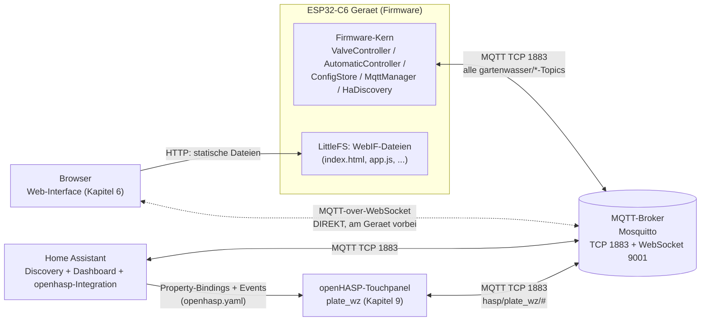
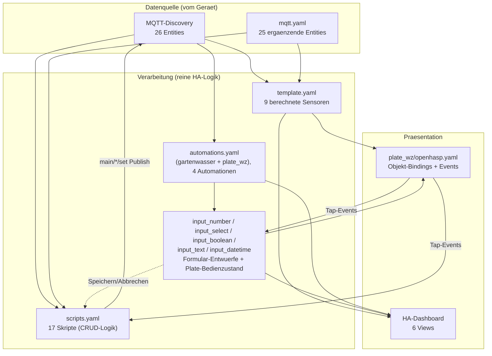
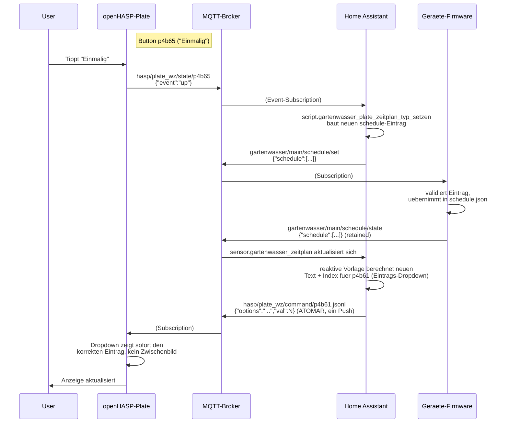
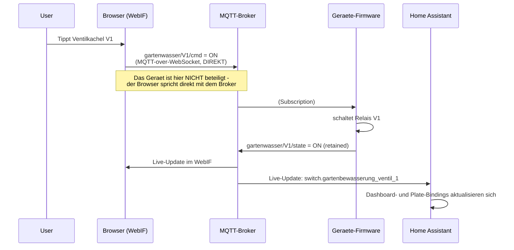

# Gartenwasser — Architektur & Zusammenhänge (nicht-C-Teil)

Ergänzt `docs/development.md` (Doxygen für die C++-Firmware) um den Teil, den Doxygen
strukturell nicht abbilden kann: YAML-Konfiguration (Home Assistant, openHASP-Plate) hat
keine Klassen/Funktionen/Aufrufbeziehungen — stattdessen dokumentiert dieses Dokument die
**Datenfluss- und Abhängigkeitsstruktur** zwischen Geräte-Firmware, MQTT, Web-Interface,
Home Assistant und dem openHASP-Touchpanel als Mermaid-Diagramme (rendern nativ in
GitHub/VS Code).

Wer welche konkrete Entity/welches konkrete Objekt betrifft: `docs/manual/usermanual.md`
Kapitel 8 (HA-Entities) und Kapitel 9 (Plate-Seiten) haben die vollständigen Tabellen —
hier geht es um die Struktur dahinter, nicht die einzelnen Namen.

## 1. System-Topologie

Wer mit wem spricht — und über welchen Weg. Der zentrale, oft übersehene Punkt: der Browser
(Web-Interface) verbindet sich für alle Live-Daten **direkt per MQTT-over-WebSocket mit dem
Broker**, nicht über einen Umweg über das Gerät (siehe `usermanual.md`, Kapitel 4.4/6) — das
Gerät liefert dem Browser nur die statischen HTML/JS-Dateien per HTTP.

**Konsequenz für die Fehlersuche:** Geht der Broker offline, sind Browser, HA und Plate
gleichermaßen betroffen — das Gerät läuft lokal autonom weiter (Ventile/Automatik/Zeitplan
laufen unabhängig von jeder Verbindung, siehe `docs/requirements.md`). Geht **nur** das
Gerät offline, laufen Broker/HA/Plate weiter, zeigen aber alle Geräte-Entities als
„nicht verfügbar" (LWT auf `gartenwasser/availability`, siehe `usermanual.md` Kapitel 8.1).

## 2. Home-Assistant-Konfigurationsschichten

Drei Schichten: **Datenquelle** (kommt vom Gerät), **Verarbeitung** (reine HA-Logik, kein
eigenes MQTT-Topic), **Präsentation** (was der Nutzer sieht/bedient). Pfeile zeigen
Abhängigkeit, nicht zeitliche Reihenfolge.

**Lesehilfe:** `SCRIPTS --> DISC` schließt den Kreis — ein Skript schreibt nicht direkt in
eine Anzeige-Entity, sondern publiziert auf ein `.../set`-Topic; das Gerät validiert,
übernimmt (oder verwirft, siehe `docs/Log.md` zu stillen Ablehnungen) und echot den neuen
Zustand zurück auf `.../state` — von dort fließt er ganz normal wieder durch `TEMPLATE`/
`DASH`/`PLATEBIND`. Kein Skript nimmt eine Abkürzung an der Firmware vorbei. Der Übersicht
halber nicht eingezeichnet: Dashboard und Plate lesen für einzelne Kacheln/Felder teils auch
direkt aus `DISC`/`MQTTY` (z. B. Firmware-Version, Alias-Textfelder) statt über `TEMPLATE`/
`HELPERS` — die Grafik zeigt die *Schichten-Rollen*, keine vollständige Kantenliste.

## 3. Datenfluss-Beispiel: Zeitplan-Eintrag am Plate bearbeiten

Konkretes Beispiel für den kompletten Rundlauf Plate → HA → MQTT → Firmware → MQTT → HA →
Plate, anhand des in dieser Session gefundenen und gefixten Mechanismus (atomare
`jsonl`-Property, siehe `docs/Log.md`, 2026-08-27).

**Warum atomar wichtig ist:** ein früherer Ansatz schrieb `options` und `val` als zwei
getrennte MQTT-Publishes — die Firmware setzt bei jedem `options`-Update die
Dropdown-Auswahl intern kurz auf Index 0 zurück, bevor der zweite Publish sie korrigiert,
was als sichtbares Aufblitzen des falschen Eintrags auffiel. Die kombinierte `jsonl`-Property
verarbeitet beide Werte in einem Firmware-Durchlauf ohne Netzwerk-Zwischenschritt.

## 4. Datenfluss-Beispiel: Ventil im Web-Interface schalten

Zeigt die Besonderheit aus Diagramm 1 konkret: der Browser nimmt beim Schalten **keinen
Umweg über das Gerät**.

Derselbe Ablauf gilt spiegelbildlich für jede Aktion, die am Dashboard oder am Plate
ausgelöst wird — alle drei Oberflächen sind gleichrangige MQTT-Teilnehmer, keine ist die
"Quelle der Wahrheit" gegenüber den anderen. Die Firmware selbst ist die einzige Instanz,
die tatsächlich validiert und persistiert.

## 5. Weiterführend

- Vollständige Entity-/Objekt-Referenz: `docs/manual/usermanual.md`, Kapitel 8 (HA) und 9 (Plate).
- Vollständiger MQTT-Topic-Baum: `docs/manual/usermanual.md`, Kapitel 7.
- C++-Firmware-Struktur (Klassen/Aufrufgraphen): [Code-Struktur durchsuchen](https://pfannex.github.io/Gartenwasser/doxygen/html/index.html) (siehe auch `docs/development.md`).
- Technische Stolpersteine/Lessons Learned zu HA/openHASP (Reload-Verhalten, Ghost-State,
  Freeze-Properties u. a.): `docs/homeassistant/README.md`.
