# Gartenwasser — Benutzerhandbuch

Automatische Gartenbewässerung auf ESP32-C6-Basis mit Touch-Display, Web-Interface und MQTT/Home-Assistant-Anbindung.

**Firmware-Version:** siehe `include/Version.h` bzw. Web-Interface → *Info* → *Firmware*
**Stand dieses Dokuments:** 2026-08-27

---

## Inhalt

1. [Überblick](#1-überblick)
2. [Hardware](#2-hardware)
3. [Schaltplan / Verkabelung](#3-schaltplan--verkabelung)
4. [Inbetriebnahme](#4-inbetriebnahme)
5. [Bedienung: Touch-Display (HMI)](#5-bedienung-touch-display-hmi)
6. [Bedienung: Web-Interface](#6-bedienung-web-interface)
7. [MQTT-Schnittstelle](#7-mqtt-schnittstelle)
8. [Home-Assistant-Integration](#8-home-assistant-integration)
9. [Bedienung: openHASP-Touchpanel (Plate)](#9-bedienung-openhasp-touchpanel-plate)
10. [Gesamtübersicht aller Bedienwege](#10-gesamtübersicht-aller-bedienwege)
11. [Firmware-Updates](#11-firmware-updates)
12. [Anhang: Fehlerbehebung](#12-anhang-fehlerbehebung)

---

## 1. Überblick

Die Gartenwasser-Steuerung schaltet bis zu 5 Bewässerungsventile (`V1`–`V5`) plus ein gemeinsames Hauptventil (`V0`), das automatisch mitgeschaltet wird, sobald mindestens ein Bewässerungsventil aktiv ist. Fünf Bedienwege stehen zur Verfügung:

| Weg | Wofür geeignet |
|---|---|
| **Touch-Display am Gerät** (Kapitel 5) | Schnelle Vor-Ort-Bedienung: Start/Stop, Ventile einzeln schalten, Programm wählen |
| **Web-Interface** (Kapitel 6) | Vollständige Konfiguration: Programme/Zeitplan anlegen, Live-Log, Firmware-Update |
| **MQTT** (Kapitel 7) | Automatisierung, Home Assistant, eigene Skripte |
| **Home Assistant** (Kapitel 8) | Dashboard-Bedienung, Sprachsteuerung/Automatisierungen, Diagnose |
| **openHASP-Touchpanel** (Kapitel 9) | Separat montiertes Wand-/Tischpanel, größerer Bildschirm als das Geräte-Display |

Alle fünf Wege greifen auf denselben Zustand zu — eine Änderung über einen Weg erscheint sofort auf den anderen (z. B. schaltet ein Touch-Tap am Display auch `V1/state` per MQTT). Nicht jeder Weg deckt jede Funktion ab — Kapitel 10 stellt eine vollständige Gegenüberstellung bereit.

**Projektumfang** (Stand dieses Dokuments): Repository-Größe ohne `.git`-Verlaufsdaten und PlatformIO-Build-Cache (`.pio`) ≈ 11 MB, davon ≈ 6,3 MB automatisch generierte Doxygen-Code-Dokumentation (Kapitel 11.5). Handgeschriebener Inhalt, nach Bereich:

| Bereich | Zeilen |
|---|---:|
| Firmware (C++, `src/`+`include/`) | ≈ 5.380 |
| Web-Interface (HTML/CSS/JS, ohne mitgelieferte Bibliotheken) | ≈ 1.340 |
| Home-Assistant-Konfiguration (YAML) | ≈ 7.080 |
| openHASP-Plate (`pages.jsonl`) | ≈ 120 |
| Dokumentation (Markdown, dieses Handbuch + `docs/`) | ≈ 4.540 |
| **Gesamt** | **≈ 18.460** |

Zusätzlich automatisch generiert (nicht Teil obiger Zahlen): die Doxygen-Ausgabe umfasst 153 Dateien mit zusammen ≈ 28.600 Zeilen HTML/XML (Kapitel 11.5) — reines Build-Artefakt, kein von Hand geschriebener Inhalt.

**Programme vs. manuelle Bedienung:** Ein *Programm* legt fest, welche Ventile mit welcher Laufzeit an der nächsten Automatik-Sequenz teilnehmen (`auto`-Flag + `time` je Ventil). Ändert man `time` oder `auto` direkt (ohne ein Programm zu wählen), springt die Anzeige automatisch auf „Manueller Modus" — das verhindert, dass eine Änderung beim nächsten Automatikstart stillschweigend überschrieben wird.

---

## 2. Hardware

### 2.1 Steuerungseinheit

**Board:** Waveshare ESP32-C6-Touch-LCD-1.47


| Merkmal | Wert |
|---|---|
| Chip | ESP32-C6FH8 (RISC-V, 160 MHz High-Performance-Core + 20 MHz Low-Power-Core) |
| RAM | 512 KB High-Performance-SRAM + 16 KB Low-Power-SRAM |
| Flash | 8 MB (onboard) |
| Display | 1.47″ IPS-LCD, 172×320 Pixel, Treiber JD9853, SPI |
| Touch | Kapazitiv, Controller AXS5106L, I2C |
| Anschluss | USB-C (Programmierung, Stromversorgung) |

Quelle Board-Daten: [Waveshare-Produktdokumentation](https://docs.waveshare.com/ESP32-C6-Touch-LCD-1.47).

**Maße:**


### 2.2 Ventile / Relais

6 Relaisausgänge (`V0`–`V5`), angesteuert über einen I2C-GPIO-Erweiterungsbaustein (siehe 2.3) — nicht direkt vom ESP32, da dessen GPIOs bereits für Display/Touch belegt sind. `V0` ist das Hauptventil und wird von der Firmware automatisch mitgeschaltet, sobald irgendein Ventil `V1`–`V5` aktiv ist (bzw. ausgeschaltet, sobald keins mehr läuft) — es muss nicht separat angesteuert werden.

Ein externes Relaismodul (6 Kanäle, potentialfrei) wird zwischen MCP23017-Ausgängen und den eigentlichen Magnetventilen benötigt — welches Modul konkret verbaut ist, hängt vom Aufbau ab und ist hier nicht Teil der Firmware-Dokumentation.

### 2.3 I/O-Erweiterung: MCP23017

16-Bit-I2C-GPIO-Expander (Microchip), stellt die 6 Ventil-Ausgänge auf Port B bereit. Adresse `0x20` (Adresspins A0–A2 alle auf GND). Teilt sich den I2C-Bus mit dem Touch-Controller (siehe Kapitel 3). Versorgungs- **und** Logikspannung (`VDD`) sind **5V**, nicht 3,3V — das Board stellt dafür einen eigenen 5V-Pin bereit (aus dem USB-C-VBUS abgeleitet).

**I2C-Pegelanpassung notwendig:** Bei `VDD = 5V` liegen die Schmitt-Trigger-Schwellen von `SDA`/`SCL` laut Microchip-Datenblatt (DS20001952C, Tabelle 1-1) bei V_IL(max) = 0,2·VDD = **1,0V** und V_IH(min) = 0,8·VDD = **4,0V**. Der I2C-Bus ist Open-Drain, der High-Pegel wird also vom Pull-up bestimmt — der muss auf 5V liegen, damit der MCP23017 zuverlässig „High" erkennt. Die ESP32-C6-GPIOs (3,3V-Logik, laut Espressif nicht 5V-tolerant) dürften dann aber nicht direkt an diesem Pegel hängen. Deshalb sitzt zwischen ESP32 und MCP23017 ein bidirektionaler I2C-Level-Shifter (siehe Kapitel 3) — `SDA`/`SCL` laufen **nicht** direkt auf dem 3,3V-Bus des ESP32, sondern über diesen Pegelwandler.

| Ventil | MCP23017-Pin (GPB) | Chip-Pin # |
|---|---|---|
| V0 (Hauptventil) | GPB7 | 8 |
| V1 | GPB2 | 3 |
| V2 | GPB3 | 4 |
| V3 | GPB4 | 5 |
| V4 | GPB5 | 6 |
| V5 | GPB6 | 7 |

---

## 3. Schaltplan / Verkabelung

Display und Touch-Controller sind bereits fest auf dem Waveshare-Board verdrahtet — hier nur relevant für die I2C-Bus-Zuordnung. MCP23017 und I2C-Level-Shifter sind separate, extern angeschlossene Bauteile.

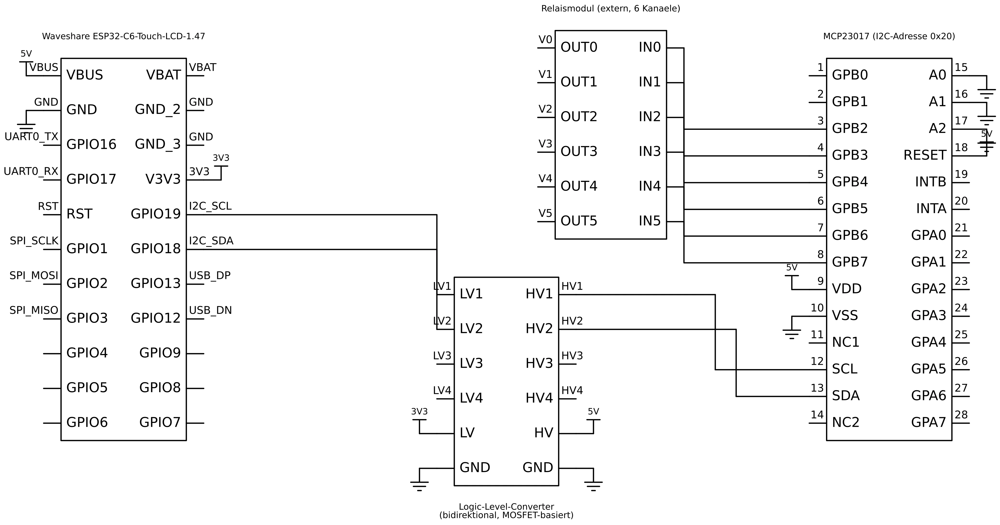

ESP32-C6-Board und MCP23017 sind vollständig mit allen Pins dargestellt (nicht nur die hier genutzte Teilmenge). Nicht beschaltete Pins (z.B. `GPIO4`–`GPIO9`, `GPA0`–`GPA7`, `INTA`/`INTB`, `NC`) sind mit offenem Ende gezeichnet. Editierbare Quelle (KiCad-Projekt): [`docs/schematics/kicad/`](../schematics/kicad/).

**Ventil-Ausgänge:** `V0` (Hauptventil) und `V1`–`V5` verlassen den Plan als Signal-Bezeichner an den jeweiligen `GPBx`-Pins (siehe Tabelle in Kapitel 2.3) — das externe Relaismodul selbst (siehe Kapitel 2.2) ist hier nicht als eigenes Bauteil gezeichnet, nur die Verbindungspunkte dorthin.

**I2C-Level-Shifter:** Ein bidirektionaler, MOSFET-basierter Pegelwandler (4-Kanal-Modul, hier werden 2 der 4 Kanäle genutzt: Kanal 3 = `SCL`, Kanal 4 = `SDA`) verbindet die 3,3V-Seite des ESP32 (`LV`) mit der 5V-Seite des MCP23017 (`HV`). Zusätzlich zu den im Modul integrierten Pull-ups sitzen an `HV3`/`HV4` noch einmal diskrete 5-kΩ-Pull-up-Widerstände (`R1`, `R2`) gegen 5V. Wirkprinzip je Kanal:

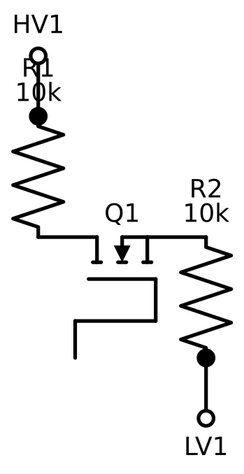

Pro Kanal sitzt ein N-Kanal-MOSFET zwischen zwei 10-kΩ-Pull-ups (einer je Spannungsseite). Gate und Source liegen auf der LV-Seite zusammen — dadurch sperrt der MOSFET, sobald die LV-Seite Low zieht (zieht dann auch HV über den Kanal nach Low), und leitet in Sperrichtung nicht, wenn die HV-Seite Low zieht (Body-Diode plus Gate-Steuerung ziehen dann auch LV nach Low). So funktioniert die Pegelanpassung unabhängig von der Übertragungsrichtung, wie es der Open-Drain-Betrieb von I2C erfordert.

**Hinweis Touch/Display-Pins** (bereits auf dem Board verdrahtet, nur zur Referenz):

| Funktion | GPIO |
|---|---|
| LCD Clock (SCK) | 1 |
| LCD Data (MOSI) | 2 |
| LCD Chip-Select | 14 |
| LCD Data/Command | 15 |
| LCD Reset | 22 |
| LCD Backlight | 23 |
| Touch SDA | 18 (geteilt mit MCP23017) |
| Touch SCL | 19 (geteilt mit MCP23017) |
| Touch Reset | 20 |
| Touch Interrupt | 21 |


Testaufbau: MCP23017 (schwarzer DIP-Chip, mittig), Test-LEDs anstelle der eigentlichen Relais/Ventile, Display/Touch-Board oben aufgesteckt.

---

## 4. Inbetriebnahme

### 4.1 Voraussetzungen

- WLAN-Zugangsdaten (2,4 GHz) und ein erreichbarer MQTT-Broker (unterstützt Standard-MQTT **und** MQTT-over-WebSocket, da das Web-Interface direkt per WebSocket mit dem Broker spricht).
- Für die Erstinbetriebnahme: USB-C-Kabel + PC mit [PlatformIO](https://platformio.org/).

### 4.2 Zugangsdaten hinterlegen

WLAN- und MQTT-Zugangsdaten liegen in `include/secrets.h` (aus `include/secrets.h.example` kopieren und anpassen, nicht Teil des Repositories/versioniert).

### 4.3 Erstes Flashen

```
pio run -e esp32-c6-devkitc-1 --target upload      # Firmware
pio run -e esp32-c6-devkitc-1 --target uploadfs    # Web-Interface-Dateien
```

Nach dem ersten erfolgreichen Boot ist das Gerät auch kabellos erreichbar (siehe Kapitel 11).

### 4.4 MQTT-Broker: WebSocket-Zugang für den Browser einrichten

Das Web-Interface verbindet sich **direkt** aus dem Browser per MQTT-over-WebSocket mit dem Broker (siehe Kapitel 1/6) — nicht über einen Umweg über den ESP32. Ein Browser kann aber keine rohe TCP-Verbindung auf den üblichen MQTT-Port 1883 öffnen, dafür braucht der Broker zusätzlich einen **WebSocket-Listener**. Das ist eine einmalige, vom Gerät unabhängige Einrichtung direkt auf dem Broker — ohne sie bleibt das Web-Interface dauerhaft auf „Getrennt“, während MQTT-Clients wie mqtt-spy oder Home Assistant (die den normalen Port 1883 nutzen) ganz normal funktionieren.

Für Mosquitto (ab Version 1.6) genügt eine zusätzliche Konfigurationsdatei, zum Beispiel `/etc/mosquitto/conf.d/websockets.conf`:

```
listener 9001
protocol websockets
allow_anonymous true
```

`allow_anonymous true` passend zum ohnehin anonymen Standard-Listener wählen (bzw. hier ergänzen, falls dieser bereits Zugangsdaten verlangt). Danach den Broker neu laden (`systemctl restart mosquitto`) und den offenen Port verifizieren (`ss -tlnp | grep 9001`).

Die resultierende Adresse (`ws://<Broker-IP>:9001/mqtt`) steht als `BROKER_WS_URL`-Konstante am Kopf jeder `data/*.js`-Datei (`app.js`, `konfig.js`, `programme.js`, `zeitplan.js`, `log.js`, `info.js`). Ändert sich Broker-IP oder -Port, muss diese Konstante in allen sechs Dateien angepasst und per `pio run --target uploadfs` neu ausgeliefert werden. Zusätzlich muss jedes Gerät, das das Web-Interface im Browser öffnet (PC, Smartphone, Tablet), Netzwerkzugriff auf diesen Port haben — genau wie auf die IP-Adresse des ESP32 selbst.

### 4.5 Erste Schritte danach

1. Web-Interface öffnen (`http://<Geräte-IP>/` — IP steht z. B. im Router oder auf der *Info*-Seite, siehe 6.7).
2. Unter *Konfiguration* Ventil-Aliasnamen vergeben und Laufzeiten prüfen.
3. Unter *Programme* mindestens ein Programm anlegen (ohne Programm kann die Automatik nicht gestartet werden — siehe 6.3).
4. Optional: Zeitplan-Einträge anlegen (Kapitel 6.4).

---

## 5. Bedienung: Touch-Display (HMI)

### 5.1 Hauptseite

| Ruhezustand | Manuell geschaltetes Ventil | Laufende Automatik |
|---|---|---|
|  | 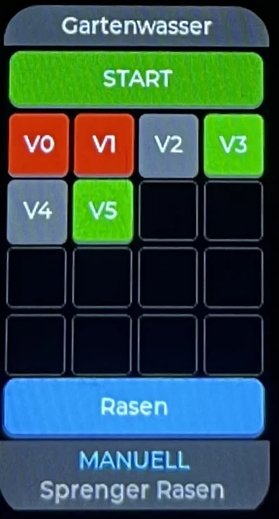 |  |

Aufbau von oben nach unten: Titelzeile, START/STOP-Button (volle Breite), Ventil-Matrix (4×4, `V0`–`V5` belegt, Rest Platzhalter für eine spätere Erweiterung), Programme-Button, zweizeilige Statuszeile.

**START/STOP:** Startet/stoppt die Automatik-Sequenz für das aktuell gewählte Programm. Ohne gewähltes Programm ist der Button gesperrt (ausgegraut) — ein Programm muss zuerst über den Programme-Button gewählt werden.

**Ventil-Matrix:** `V1`–`V5` sind antippbar und schalten das jeweilige Ventil sofort manuell (nicht während einer laufenden Automatik — das wird ignoriert). Farblogik:
- **Grün:** Ventil aus, für Automatik vorgesehen (`auto = ON`)
- **Dunkelgrau:** Ventil aus, nicht Teil der Automatik
- **Rot:** Ventil aktiv (läuft gerade)

`V0` (Hauptventil) hat keine eigene Tap-Funktion — es folgt automatisch `V1`–`V5`.

**Programme-Button:** Zeigt den Namen des aktiven Programms, bzw. „Manueller Modus", wenn keins gewählt ist. Tippen öffnet die Programme-Unterseite. Während einer laufenden Automatik gesperrt.

**Statuszeile** (Fußleiste, zeigt je nach Zustand):
1. I2C-Fehler (rot/gelb) — höchste Priorität
2. Laufende Automatik: aktives Ventil + Restlaufzeit `V{n} mm:ss | mm:ss` (aktuelles Ventil | Gesamtrest)
3. Manuell geschaltetes Ventil: „MANUELL" + Alias-Name
4. Sonst leer

### 5.2 Programme-Unterseite


Über den Programme-Button erreichbar. `‹`/`›` blättert durch alle angelegten Programme (inkl. „Kein Programm"). **OK** wendet das durchgeblätterte Programm an — startet aber **nichts**, der Start bleibt ein separater Schritt über den START-Button auf der Hauptseite. **Abbrechen** verwirft die Auswahl.

> Der Zeitplan (wiederkehrende Automatik-Termine) lässt sich **nicht** am Display bearbeiten — dafür ist das 172×320px-Display zu klein. Das läuft ausschließlich über das Web-Interface (Kapitel 6.5).

---

## 6. Bedienung: Web-Interface

Erreichbar über `http://<Geräte-IP>/` im Browser (Smartphone, Tablet, PC — kein Login nötig). Der Browser verbindet sich für alle Live-Daten direkt per MQTT-over-WebSocket mit dem Broker; das Gerät liefert nur die statischen Seiten aus. Alle sieben Seiten teilen sich dieselbe Navigationsleiste oben.

### 6.1 Status (Startseite)

| Ruhezustand | Laufende Automatik |
|---|---|
|  | 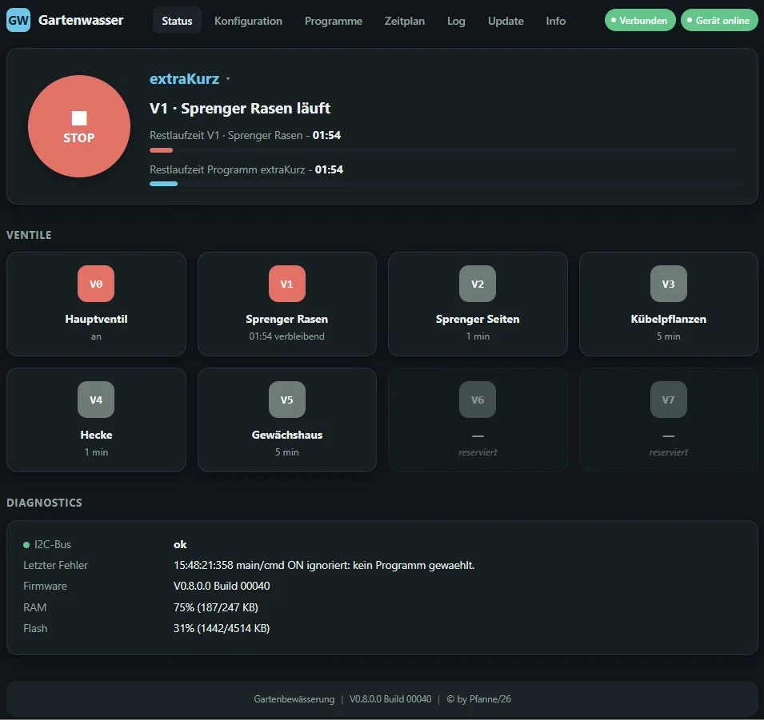 |

Übersicht: START/STOP-Button + Programmwahl im Hero-Bereich, „Nächster Termin" (nächster Zeitplan-Trigger, im Browser berechnet) bzw. bei laufender Automatik Restlaufzeit + Fortschrittsbalken für aktuelles Ventil und Gesamtsequenz, Ventilkacheln mit Live-Status/Restlaufzeit, sowie eine Diagnostics-Karte (I2C-Status, letzter Fehler, Firmware-Version, RAM/Flash-Auslastung).

### 6.2 Konfiguration


Editierbar je Ventil: **Alias** (Klartextname) und **Laufzeit** (`time`, Minuten). Zusätzlich global: **maxTime** (Obergrenze pro Ventil — die tatsächlich verwendete Laufzeit ist `min(time, maxTime)`, überschrittene Werte werden gelb markiert).

> Das `auto`-Flag (Teilnahme an der Automatik) ist hier **nicht** mehr editierbar — das läuft ausschließlich über Programme (Kapitel 6.3). Jede Änderung von `time` an dieser Stelle setzt die Programmwahl automatisch auf „Manueller Modus" zurück (siehe Kapitel 1).

### 6.3 Programme


Bis zu 32 Programme, jeweils mit Name + je Ventil `time`/`auto`. Karten-Ansicht mit Aktivieren/Bearbeiten/Löschen.


Der Editor zeigt für jedes Ventil einen Automatik-Schalter und ein Laufzeit-Feld — nur Ventile mit Automatik EIN werden Teil der Sequenz beim Start.

### 6.4 Zeitplan


Bis zu 16 Einträge, je Eintrag: verknüpftes Programm (per Name), Trigger-Typ (**täglich**, **wöchentlich** mit Wochentagsauswahl, oder **einmalig** mit Datum), Uhrzeit, aktiv/pausiert. Globaler Schalter „Zeitplan aktiv" (z. B. für Urlaub — deaktiviert alle Trigger, ohne die Konfiguration zu löschen). Abgelaufene „einmalig"-Termine lassen sich über einen Button gesammelt entfernen.


### 6.5 Log

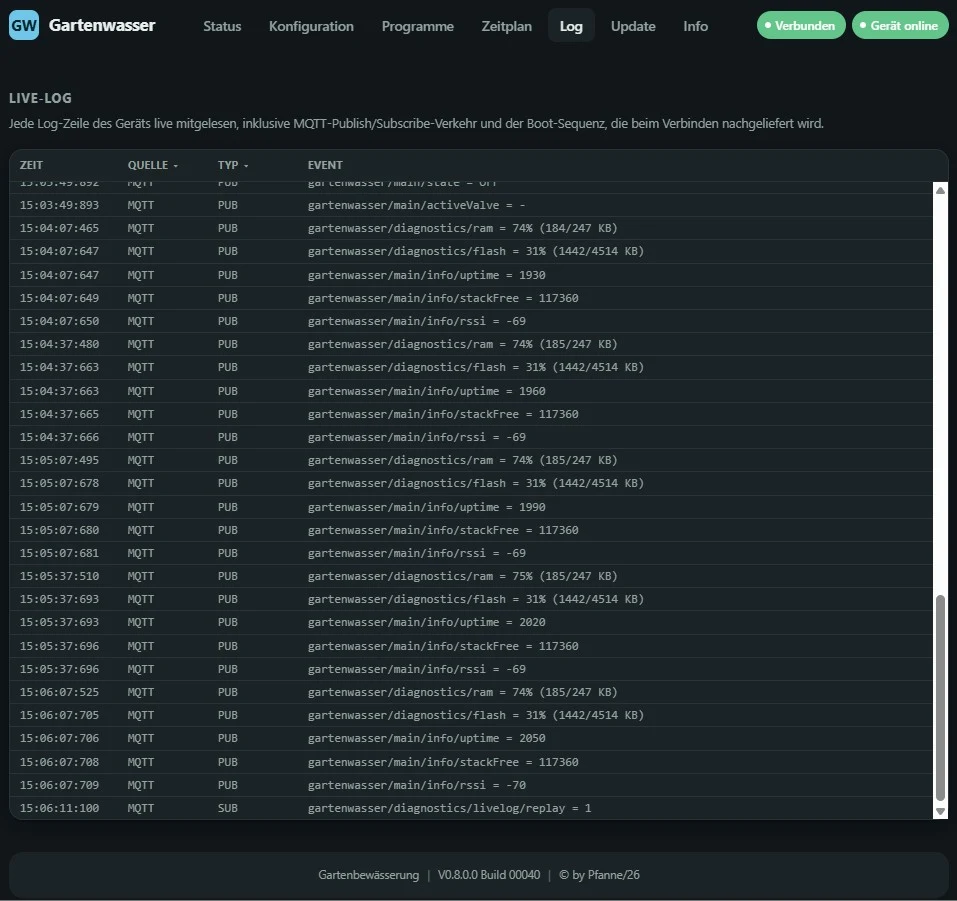

Live-Mitschnitt aller Logmeldungen des Geräts (inklusive der Boot-Sequenz und allem MQTT-Publish-/Subscribe-Verkehr). Filterbar nach Quelle und Typ (Fehler/Info/Debug/Publish/Subscribe), Volltextsuche über die Event-Spalte (Spaltenüberschrift wird per Klick zum Live-Suchfeld). JSON-Nutzlasten (z. B. Konfigurationsstände) lassen sich über einen „JSON-Payload"-Button einzeln aufklappen:


### 6.6 Update


Firmware- und Dateisystem-Update direkt aus dem Browser, ohne Entwicklungsumgebung — siehe Kapitel 11.

### 6.7 Info


Gruppierte Hardware-/Systeminformationen: Firmware-Version + Build-Nummer + Uptime + letzter Neustart-Grund, Speicher (RAM/Flash/freier Stack), Partitionstabelle mit Belegung, Netzwerk (IP, WLAN-Signalstärke, MQTT-Broker), sowie feste Hardware-Eckdaten (Board/RAM/Flash/Display/Touch/I-O, siehe Kapitel 2).

---

## 7. MQTT-Schnittstelle

Alle Topics beginnen mit `gartenwasser/`. `retain=ja` bedeutet: der letzte Wert bleibt beim Broker gespeichert, ein neu verbundener Client bekommt ihn sofort.

### 7.1 Gesamter Topic-Baum

```
TOPIC                   | RETAIN | VALUE                        | BEDEUTUNG
---------------------------------------------------------------------------
gartenwasser/           |        |                              |
├── availability        | ja     | online|offline               | Last Will (Verbindungsstatus)
├── V0/                 |        |                              |
│   ├── state           | ja     | ON|OFF                       | read-only, folgt V1-V5
│   ├── alias           | ja     | "Hauptventil"                | Klartextname
│   └── alias/set       | nein   | "Text"                       | Alias-Namen editieren
├── V1/ .. V5/          |        |                              |
│   ├── state           | ja     | ON|OFF                       | read-only, Ist-Zustand
│   ├── cmd             | nein   | ON|OFF                       | Ventil schalten
│   ├── alias           | ja     | "Rasen Seite"                | Klartextname
│   │   └── set         | nein   | "Text"                       | Alias-Namen editieren
│   ├── time/           |        |                              |
│   │   ├── state       | ja     | <Minuten>                    | aktuell eingestellte Laufzeit
│   │   ├── set         | nein   | <Minuten>                    | Laufzeit setzen
│   │   └── remaining   | nein   | mm:ss                        | Restlaufzeit, Sekundentakt
│   └── auto/           |        |                              |
│       ├── state       | ja     | ON|OFF                       | Automatik-Flag Ist
│       └── set         | nein   | ON|OFF                       | Automatik-Flag setzen (löst „Manueller Modus“ aus)
├── main/               |        |                              |
│   ├── cmd             | nein   | ON|OFF                       | Start/Stop der Automatik-Sequenz
│   ├── state           | ja     | ON|OFF                       | Sequenz läuft?
│   ├── activeValve     | ja     | "V1".."V5"|"-"               | aktuell aktives Ventil
│   ├── remainingTotal  | nein   | mm:ss                        | Restzeit der gesamten Sequenz
│   ├── time/           |        |                              |
│   │   └── maxTime     | ja     | <Minuten>                    | Obergrenze pro Ventil, effektiv = min(time, maxTime)
│   ├── config/         |        |                              |
│   │   ├── set         | nein   | JSON                         | time/auto/alias/maxTime setzen (ganz oder teilweise)
│   │   └── state       | ja     | JSON                         | aktueller Gesamtstand von config
│   ├── programs/       |        |                              |
│   │   ├── set         | nein   | JSON                         | Programme-Array + activeProgram setzen (ersetzt Array komplett)
│   │   └── state       | ja     | JSON                         | aktueller Gesamtstand von programs
│   ├── program/        |        |                              |
│   │   ├── cmd         | nein   | <integer>                    | Programm per Index auswählen, 1-basiert (0 = keins)
│   │   └── state       | ja     | JSON                         | {"index":n,"name":"..."}, aktuell gewähltes Programm
│   ├── schedule/       |        |                              |
│   │   ├── set         | nein   | JSON                         | Zeitplan-Array + enabled setzen (ersetzt Array komplett)
│   │   ├── state       | ja     | JSON                         | aktueller Gesamtstand von schedule
│   │   ├── cmd         | nein   | ON|OFF                       | globaler Ein/Aus-Schalter
│   │   └── cleanup     | nein   | beliebig                     | entfernt abgelaufene „einmalig“-Einträge
│   └── info/           |        |                              | Hardware-/Systeminfo (Info-Seite)
│       ├── resetReason | ja     | z. B. "USB"                  | Grund des letzten Neustarts, einmalig pro Boot
│       ├── uptime      | ja     | <Sekunden>                   | Laufzeit seit Boot, alle 30s
│       ├── stackFree   | ja     | <Byte>                       | freier loopTask-Stack, alle 30s
│       ├── rssi        | ja     | <dBm, negativ>               | WLAN-Signalstärke, alle 30s
│       ├── ip          | ja     | z. B. "192.168.10.33"        | eigene IP-Adresse, einmalig pro Boot
│       ├── broker      | ja     | z. B. "192.168.1.123:1883"   | MQTT-Broker-Adresse, einmalig pro Boot
│       └── partitions  | ja     | JSON-Array                   | Partitionstabelle inkl. Belegung, einmalig pro Boot
└── diagnostics/        |        |                              |
    ├── i2cStatus       | ja     | ok|error                     | Status I2C-Bus / MCP23017
    ├── lastError       | ja     | <Text/Zeitstempel>           | letzte Fehlermeldung
    ├── version         | ja     | z. B. "V0.8.0.0 Build 00019" | Firmware-Version
    ├── ram             | ja     | z. B. "63% (206/328 KB)"     | Heap-Nutzung, alle 30s
    ├── flash           | ja     | z. B. "45% (1382/3072 KB)"   | Sketch-Größe vs. freier App-Slot
    ├── livelog         | nein   | Log-Zeile (Text)             | jede Logger-Zeile, inkl. PUB/SUB
    └── livelog/replay  | nein   | beliebig                     | Einmalbefehl: kompletten Log-Ringpuffer erneut senden
```

Die Detail-Tabellen (7.2–7.7) zeigen dieselben Topics einzeln mit Retain-Flag, Werteformat und ausführlicherer Beschreibung.

### 7.2 Ventile (`V0`–`V5`)

| Topic | Retain | Wert | Bedeutung |
|---|---|---|---|
| `V0/state` | ja | `ON`/`OFF` | Ist-Zustand (read-only, folgt V1-V5) |
| `V0/alias`, `V0/alias/set` | ja / – | Text | Klartextname |
| `V{1-5}/state` | ja | `ON`/`OFF` | Ist-Zustand |
| `V{1-5}/cmd` | – | `ON`/`OFF` | Ventil schalten |
| `V{1-5}/alias`, `.../alias/set` | ja / – | Text | Klartextname |
| `V{1-5}/time/state`, `.../time/set` | ja / – | Minuten | Konfigurierte Laufzeit |
| `V{1-5}/time/remaining` | nein | `mm:ss` | Restlaufzeit, sekündlich |
| `V{1-5}/auto/state`, `.../auto/set` | ja / – | `ON`/`OFF` | Automatik-Teilnahme (**Hinweis:** direktes Setzen löst „Manueller Modus" aus, siehe Kapitel 1) |

### 7.3 Automatik-Sequenz (`main/`)

| Topic | Retain | Wert | Bedeutung |
|---|---|---|---|
| `main/cmd` | – | `ON`/`OFF` | Start/Stop |
| `main/state` | ja | `ON`/`OFF` | Läuft die Sequenz? |
| `main/activeValve` | ja | `V1`–`V5`/`-` | Aktuell aktives Ventil |
| `main/remainingTotal` | nein | `mm:ss` | Restzeit der Gesamtsequenz |
| `main/time/maxTime` | ja | Minuten | Globale Obergrenze pro Ventil |

### 7.4 Konfiguration / Programme / Zeitplan

| Topic | Retain | Wert | Bedeutung |
|---|---|---|---|
| `main/config/set`, `main/config/state` | – / ja | JSON | time/auto/alias/maxTime, ganz oder teilweise |
| `main/programs/set`, `main/programs/state` | – / ja | JSON | Programme-Array (Array-Replace) + activeProgram |
| `main/program/cmd`, `main/program/state` | – / ja | Index / JSON | Programm auswählen (1-basiert, 0 = keins) |
| `main/schedule/set`, `main/schedule/state` | – / ja | JSON | Zeitplan-Array (Array-Replace) + enabled |
| `main/schedule/cmd` | – | `ON`/`OFF` | Zeitplan global ein/aus |
| `main/schedule/cleanup` | – | beliebig | Abgelaufene „einmalig"-Einträge entfernen |

Acht Topics in dieser Gruppe tragen JSON — jedes einzeln, da sich `set` und `state` nicht immer dieselbe Struktur teilen:

**`main/config/set`** — akzeptiert eine **beliebige Teilmenge** von `time`/`auto`/`alias`/`maxTime`; nicht enthaltene Felder bleiben unverändert. Beispiel für ein Teil-Update (nur Laufzeit + Automatik von `V2` ändern):

```json
{
  "time": {"V2": 12},
  "auto": {"V2": true}
}
```

**`main/config/state`** — immer der **vollständige** aktuelle Stand, unabhängig davon, wie viel das letzte `set` enthielt. `time`/`auto`/`alias` sind je Ventil geschlüsselte Objekte (`time`/`auto` nur `V1`–`V5`, `alias` zusätzlich `V0`), `maxTime` steht auf oberster Ebene (geräteweite Obergrenze, kein Wert je Ventil). Genau dafür gedacht: als **Backup** sichern und später unverändert auf `.../set` zurückspielen — Beispiel mit `mosquitto_sub`/`mosquitto_pub` in Kapitel 7.7:

```json
{
  "time": {"V1": 5, "V2": 12, "V3": 5, "V4": 15, "V5": 5},
  "auto": {"V1": true, "V2": true, "V3": false, "V4": true, "V5": false},
  "alias": {
    "V0": "Hauptventil",
    "V1": "Rasen Vorgarten",
    "V2": "Rasen Garten",
    "V3": "Beet Rosen",
    "V4": "Beet Gemüse",
    "V5": "Kübelpflanzen"
  },
  "maxTime": 30
}
```

**`main/programs/set`** — Array-Replace: **immer das vollständige** Array, kein Teil-Update wie bei `config` (fehlt ein Programm gegenüber dem alten Stand, ist es danach gelöscht). `time`/`auto` je Programm sind sparse — nur aufgeführte Ventile werden beim Anwenden verändert, fehlende bleiben, wie sie sind. `activeProgram` ist 1-basiert, `0` = kein Programm gewählt („Manueller Modus", Kapitel 1):

```json
{
  "programs": [
    {"name": "Kurz",  "time": {"V1": 2, "V2": 2}, "auto": {"V1": true, "V2": true, "V3": false, "V4": false, "V5": false}},
    {"name": "Rasen", "time": {"V1": 10, "V2": 10}, "auto": {"V1": true, "V2": true, "V3": false, "V4": false, "V5": false}},
    {"name": "Alles", "time": {"V1": 8, "V2": 8, "V3": 12, "V4": 15, "V5": 6}, "auto": {"V1": true, "V2": true, "V3": true, "V4": true, "V5": true}}
  ],
  "activeProgram": 2
}
```

**`main/programs/state`** — Echo des zuletzt akzeptierten `set`, **identische Struktur** wie oben (keine Teilmenge möglich, da `set` ohnehin immer vollständig sein muss).

**`main/program/cmd`** — kein JSON, sondern ein einzelner Integer (Programm-Index, 1-basiert, `0` = keins): `2`

**`main/program/state`** — knappes JSON, nur Index + Name des gerade aktiven Programms (redundant zu `programs/state.activeProgram`, aber ohne das komplette Array mitzuschicken):

```json
{"index": 2, "name": "Rasen"}
```

**`main/schedule/set`** — Array-Replace wie bei `programs`: **immer das vollständige** Zeitplan-Array. Das äußere `enabled` ist der globale Zeitplan-Schalter (Kapitel 6.4), `enabled` je Eintrag pausiert nur diesen einen. `weekdays` (nur bei `type: "weekly"`) nutzt englische Drei-Buchstaben-Kürzel klein geschrieben (`mon`…`sun`); `date` (nur bei `type: "once"`) im Format `YYYY-MM-DD`. `program` referenziert ein Programm per **Name**, nicht per Index. Ein Eintrag darf **entweder** `weekdays` **oder** `date` enthalten, nie beide gleichzeitig — die Firmware verwirft sonst den kompletten Eintrag kommentarlos:

```json
{
  "enabled": true,
  "schedule": [
    {"enabled": true, "type": "daily", "time": "21:00", "program": "Rasen"},
    {"enabled": true, "type": "weekly", "weekdays": ["tue", "fri"], "time": "20:00", "program": "Beete"},
    {"enabled": true, "type": "once", "date": "2026-02-01", "time": "11:00", "program": "Kurz"}
  ]
}
```

**`main/schedule/state`** — Echo des zuletzt akzeptierten `set`, **identische Struktur** wie oben.

### 7.5 Diagnose (`diagnostics/`)

| Topic | Retain | Wert | Bedeutung |
|---|---|---|---|
| `diagnostics/i2cStatus` | ja | `ok`/`error` | I2C-Bus / MCP23017 erreichbar? |
| `diagnostics/lastError` | ja | Text | Letzte Fehlermeldung |
| `diagnostics/version` | ja | z. B. „V0.8.0.0 Build 00019" | Firmware-Version |
| `diagnostics/ram`, `diagnostics/flash` | ja | z. B. „63% (206/328 KB)" | Speicherauslastung, alle 30s |
| `diagnostics/livelog`, `.../livelog/replay` | nein | Text / beliebig | Live-Log-Stream + Anfrage-Replay |

### 7.6 Hardware-/Systeminfo (`main/info/`)

| Topic | Retain | Wert | Bedeutung |
|---|---|---|---|
| `main/info/resetReason` | ja | z. B. „USB" | Grund des letzten Neustarts |
| `main/info/uptime` | ja | Sekunden | Laufzeit seit Boot |
| `main/info/stackFree` | ja | Byte | Freier loopTask-Stack |
| `main/info/rssi` | ja | dBm | WLAN-Signalstärke |
| `main/info/ip`, `main/info/broker` | ja | Text | Eigene IP / Broker-Adresse |
| `main/info/partitions` | ja | JSON-Array | Partitionstabelle inkl. Belegung |

**`main/info/partitions`** — `active` erscheint nur bei den beiden App-Partitionen (`app0`/`app1`, zeigt den gerade aktiven OTA-Slot); `used` nur, wo tatsächlich ermittelbar (aktiver App-Slot: Sketch-Größe; `webfs`/`config`: Dateisystem-Belegung) — `nvs`, `otadata` und `coredump` haben kein `used`-Feld.

```json
[
  {"label": "app0", "size": 3145728, "active": true, "used": 987654},
  {"label": "app1", "size": 3145728, "active": false},
  {"label": "nvs", "size": 20480},
  {"label": "otadata", "size": 8192},
  {"label": "webfs", "size": 1835008, "used": 456789},
  {"label": "config", "size": 131072, "used": 2048},
  {"label": "coredump", "size": 65536}
]
```

### 7.7 Beispiele

```bash
# Ventil V1 manuell einschalten
mosquitto_pub -t gartenwasser/V1/cmd -m ON

# Programm 2 auswählen und Automatik starten
mosquitto_pub -t gartenwasser/main/program/cmd -m 2
mosquitto_pub -t gartenwasser/main/cmd -m ON

# Live-Log ab jetzt mitlesen
mosquitto_sub -t gartenwasser/diagnostics/livelog

# Konfiguration sichern (Snapshot in eine Datei)
mosquitto_sub -t gartenwasser/main/config/state -C 1 > config-backup.json

# ... und später wiederherstellen
mosquitto_pub -t gartenwasser/main/config/set -f config-backup.json
```

Dasselbe Prinzip (Snapshot vom `.../state`-Topic sichern, später unverändert auf das zugehörige `.../set`-Topic zurückspielen) funktioniert genauso für `main/programs/state` → `main/programs/set` und `main/schedule/state` → `main/schedule/set` — beide sind ebenfalls retained und liefern immer den vollständigen aktuellen Stand (Kapitel 7.4). Ein Restore ersetzt bei allen dreien den kompletten Bereich — bei `programs`/`schedule` ist das ohnehin die einzige Möglichkeit (Array-Replace), bei `config` ist es ein Sonderfall des sonst auch teilweise möglichen Updates.

---

## 8. Home-Assistant-Integration

Home Assistant bindet das Gerät auf zwei sich ergänzenden Wegen ein: automatische **MQTT-Discovery** (26 Entities, kommen ohne jede manuelle Konfiguration, sobald das Gerät online ist) plus eine mitgelieferte, manuell einzubindende **Ergänzungskonfiguration** (`HomeAssistant/` im Repository) für alles, was Discovery allein nicht abbilden kann — Alias-Namen, Programm-/Zeitplan-Verwaltung, ein vollständiges Dashboard sowie die Anbindung des openHASP-Touchpanels (Kapitel 9). Einrichtungsschritte im Detail: `docs/homeassistant/README.md`.

### 8.1 Automatisch erkannte Entities (MQTT-Discovery)

Erscheinen als ein Gerät „Gartenbewässerung" unter *Einstellungen → Geräte & Dienste*, sobald das Gerät zum ersten Mal mit dem Broker verbindet — keine Handarbeit nötig. Alle 26 Entities hängen an `gartenwasser/availability` (Kapitel 7.1): geht das Gerät offline, erscheinen sie gemeinsam als „nicht verfügbar".

| Entity | Domäne | Geräte-Topic(s) | Bedeutung | Bedienbar? |
|---|---|---|---|---|
| `binary_sensor.gartenbewasserung_hauptventil` | binary_sensor | `V0/state` | Hauptventil (V0) an/aus | nur Anzeige |
| `switch.gartenbewasserung_ventil_1` … `_5` | switch | `V{n}/cmd` (Befehl) / `V{n}/state` (Ist) | Ventil V1–V5 an/aus | ja, direkt schaltbar |
| `binary_sensor.gartenbewasserung_ventil_1_automatik` … `_5` | binary_sensor | `V{n}/auto/state` | Nimmt das Ventil an der Automatik teil? | nur Anzeige (Änderung nur über Programme, siehe Kapitel 1) |
| `number.gartenbewasserung_ventil_1_laufzeit` … `_5` | number | `V{n}/time/set` (Befehl) / `V{n}/time/state` (Ist) | Konfigurierte Laufzeit je Ventil (Minuten) | ja |
| `sensor.gartenbewasserung_ventil_1_restlaufzeit` … `_5` | sensor | `V{n}/time/remaining` | Rohe Restlaufzeit-Angabe der Firmware | nur Anzeige |
| `switch.gartenbewasserung_automatik_sequenz` | switch | `main/cmd` (Befehl) / `main/state` (Ist) | Automatik-Sequenz Start/Stop | ja |
| `sensor.gartenbewasserung_aktives_ventil` | sensor | `main/activeValve` | Aktuell aktives Ventil der Sequenz | nur Anzeige |
| `sensor.gartenbewasserung_restzeit_sequenz` | sensor | `main/remainingTotal` | Restzeit der Gesamtsequenz (roh) | nur Anzeige |
| `sensor.gartenbewasserung_i2c_status` | sensor | `diagnostics/i2cStatus` | I2C-Bus/MCP23017 erreichbar? (`ok`/`error`) | nur Anzeige — **zentraler Offline-Indikator**, siehe Kapitel 8.6 |
| `sensor.gartenbewasserung_letzter_fehler` | sensor | `diagnostics/lastError` | Letzte Fehlermeldung der Firmware | nur Anzeige |

Alle Topics ohne führenden Pfad sind relativ zu `gartenwasser/` (siehe Kapitel 7.1) — `V{n}` steht für `V0`–`V5` (Discovery erzeugt je Ventil V1–V5 eigene Entities, `V0` nur als `binary_sensor`).

> Die rohen Restlaufzeit-Sensoren (`_restlaufzeit`/`_restzeit_sequenz`) werden von der mitgelieferten Konfiguration **nicht** direkt anzeigt — stattdessen berechnen eigene Template-Sensoren (Kapitel 8.3) die Restzeit robuster aus Schaltzeitpunkt + konfigurierter Laufzeit, unabhängig vom nicht-retained MQTT-Sekundentakt.

### 8.2 Ergänzende Entities (manuell mitgeliefert, `mqtt.yaml`)

Decken ab, was Discovery nicht kann: Alias-Namen (kein Discovery-Topic dafür vorgesehen), Programme/Zeitplan als strukturierte JSON-Objekte, sowie Diagnose-/Systeminfo im Klartext.

| Entity | Domäne | Geräte-Topic(s) | Bedeutung |
|---|---|---|---|
| `text.gartenwasser_v0_alias` … `_v5_alias` | text | `V{n}/alias` (Ist) / `V{n}/alias/set` (Befehl) | Ventil-Aliasnamen, editierbar |
| `number.gartenwasser_v1_laufzeit` … `_v5_laufzeit` | number | `V{n}/time/state` (Ist) / `V{n}/time/set` (Befehl) | Alternative Laufzeit-Entities (Alias-nahes Pendant zu 8.1, dieselben Topics) |
| `number.gartenwasser_max_time` | number | `main/time/maxTime` (Ist) / `main/config/set` (Befehl, JSON `{"maxTime": …}`) | Globale Obergrenze pro Ventil |
| `sensor.gartenwasser_programme` | sensor | `main/programs/state` | Anzahl Programme; Attribute `programs[]` (komplette Liste) + `activeProgram` |
| `sensor.gartenwasser_zeitplan` | sensor | `main/schedule/state` | Attribut `schedule[]` — komplette Zeitplan-Liste |
| `switch.gartenwasser_zeitplan_aktiv` | switch | `main/schedule/state` (Feld `enabled`, Ist) / `main/schedule/cmd` (Befehl) | Globaler Zeitplan-Schalter |
| `sensor.gartenwasser_firmware` | sensor | `diagnostics/version` | Firmware-Version + Build-Nummer |
| `sensor.gartenwasser_ram` | sensor | `diagnostics/ram` | RAM-Auslastung in Prozent |
| `sensor.gartenwasser_flash` | sensor | `diagnostics/flash` | Flash-Auslastung in Prozent |
| `sensor.gartenwasser_reset_grund` | sensor | `main/info/resetReason` | Grund des letzten Neustarts |
| `sensor.gartenwasser_uptime` | sensor | `main/info/uptime` | Laufzeit seit Boot |
| `sensor.gartenwasser_stack_free` | sensor | `main/info/stackFree` | Freier loopTask-Stack |
| `sensor.gartenwasser_rssi` | sensor | `main/info/rssi` | WLAN-Signalstärke |
| `sensor.gartenwasser_ip` | sensor | `main/info/ip` | Eigene IP-Adresse |
| `sensor.gartenwasser_broker` | sensor | `main/info/broker` | MQTT-Broker-Adresse |
| `sensor.gartenwasser_partitionen` | sensor | `main/info/partitions` | Partitionstabelle als Attribut (JSON-Array) |

Auch hier: alle Topics relativ zu `gartenwasser/`. Diese Entities laufen **parallel** zu den 26 Discovery-Entities aus 8.1 (eigene `unique_id`, teils identisches Topic wie z. B. bei den Laufzeit-Entities) — kein Konflikt, aber bei einigen Werten (Laufzeit V1–V5) existieren dadurch bewusst zwei unabhängige HA-Entities für dasselbe Geräte-Topic.

### 8.3 Berechnete Entities (Template-Sensoren)

Rein HA-seitig berechnet, kein eigenes MQTT-Topic. Zweck: robustere Restzeit-Anzeige, die nicht auf den nicht-retained `.../time/remaining`-Sekundentakt angewiesen ist, sondern aus `switch`-Schaltzeitpunkt (`last_changed`) + konfigurierter Laufzeit rechnet — übersteht dadurch z. B. einen HA-Neustart mitten in einem laufenden Ventil unbeschadet.

| Entity | Geräte-Topic | Berechnet aus | Bedeutung |
|---|---|---|---|
| `sensor.gartenwasser_v1_restlaufzeit_prozent` … `_v5_...` | **– kein Topic** | `switch.gartenbewasserung_ventil_{n}` (Zustand + `last_changed`) + `number.gartenbewasserung_ventil_{n}_laufzeit` | Restlaufzeit je Ventil in Prozent (für Fortschrittsbalken) |
| `sensor.gartenwasser_v1_restzeit_text` … `_v5_...` | **– kein Topic** | dieselben wie oben | Restlaufzeit je Ventil als „mm:ss Min."-Text |
| `sensor.gartenwasser_sequenz_restlaufzeit_prozent` | **– kein Topic** | `switch.gartenbewasserung_automatik_sequenz` + `sensor.gartenwasser_gesamtlaufzeit` | Restzeit der Gesamtsequenz in Prozent |
| `sensor.gartenwasser_sequenz_restzeit_text` | **– kein Topic** | dieselben wie oben | Restzeit der Gesamtsequenz als Text |
| `sensor.gartenwasser_gesamtlaufzeit` | **– kein Topic** | `binary_sensor.gartenbewasserung_ventil_{n}_automatik` + `number.gartenbewasserung_ventil_{n}_laufzeit` (alle 5 Ventile) | Angenäherte Gesamtdauer der aktuellen Sequenz (Summe der `auto=on`-Laufzeiten — Näherung, siehe Backlog-Idee in `docs/requirements.md`) |

### 8.4 Helper-Entities (Formulare, Entwürfe, Plate-Bedienzustand)

Reine Hilfs-Entities ohne eigene MQTT-Anbindung — halten Zwischenzustände von Formularen bzw. den aktuellen Bedienzustand des openHASP-Panels fest. Nicht für die direkte Bedienung gedacht, werden ausschließlich von Skripten/Automationen bzw. den Dashboard-Formularen verwendet.

| Zweck | Geräte-Topic | Entities |
|---|---|---|
| Programm-Editor (Entwurf vor „Speichern") | **– kein Topic** | `input_text.gartenwasser_entwurf_name`, `input_boolean.gartenwasser_entwurf_v1_auto`…`_v5_auto`, `input_number.gartenwasser_entwurf_v1_zeit`…`_v5_zeit`, `input_number.gartenwasser_editier_index` |
| Zeitplan-Editor (Entwurf vor „Speichern") | **– kein Topic** | `input_select.gartenwasser_zeitplan_entwurf_program`, `input_select.gartenwasser_zeitplan_entwurf_type`, `input_datetime.gartenwasser_zeitplan_entwurf_zeit`, `input_datetime.gartenwasser_zeitplan_entwurf_datum`, `input_boolean.gartenwasser_zeitplan_entwurf_mon`…`_sun`, `input_number.gartenwasser_zeitplan_editier_index` |
| Programm-Dropdown-Sync (Status-Seite/Plate) | **– kein eigenes Topic**, aber per Automation (8.5) bidirektional mit `main/program/cmd`/`main/program/state` synchron gehalten | `input_select.gartenwasser_programm` |
| openHASP-Plate — Settings-Seite (Kapitel 9.3) | **– kein Topic** | `input_select.gartenwasser_plate_settings_kategorie`, `input_number.gartenwasser_plate_settings_ventil`, `input_number.gartenwasser_plate_settings_programm`, `input_number.gartenwasser_plate_settings_zeitplan_eintrag`, `input_boolean.gartenwasser_plate_settings_zeit_minute_modus`, `input_select.gartenwasser_plate_settings_datum_feld` |

Alle Helper-Entities sind reine HA-`input_*`-Domänen (`input_text`/`input_boolean`/`input_number`/`input_select`/`input_datetime`) ohne MQTT-Integration — technisch **könnten** sie gar nicht an ein Geräte-Topic gebunden sein, selbst wenn gewollt.

### 8.5 Automationen und Skripte

| Name | Auslöser | Wirkung |
|---|---|---|
| „Programme-Liste synchronisieren" | `sensor.gartenwasser_programme` ändert sich | Aktualisiert die Optionsliste von `input_select.gartenwasser_programm` |
| „Aktives Programm → Dropdown" | Aktives Programm ändert sich am Gerät | Zieht `input_select.gartenwasser_programm` nach (bidirektional, kein Rückkopplungsrisiko) |
| „Dropdown → Programm wählen" | `input_select.gartenwasser_programm` wird in HA geändert | Publiziert den passenden Index an `main/program/cmd` |
| „openHASP plate_wz: Backlight bei Idle dimmen" | Plate meldet Idle-Zustand | Dimmt die Hintergrundbeleuchtung des Panels |
| `script.gartenwasser_programm_*` (neu/bearbeiten/speichern/löschen/abbrechen) | Dashboard-Buttons (Kapitel 8.6) | Programm-CRUD über die Entwurfs-Helper aus 8.4 |
| `script.gartenwasser_zeitplan_eintrag_*` (neu/bearbeiten/speichern/löschen/abbrechen/toggle_aktiv) | Dashboard-Buttons (Kapitel 8.6) | Zeitplan-Eintrag-CRUD über die Entwurfs-Helper aus 8.4 |
| `script.gartenwasser_plate_*` (7 Skripte: Programm-AUTO-Toggle, Laufzeit, Zeitplan-Typ/-Zeit/-Wochentag/-Datum/-Programm setzen) | Taps auf dem openHASP-Panel (Kapitel 9.3) | Direktes Schreiben einzelner Felder (kein Entwurf/Speichern-Workflow wie im Dashboard) |

### 8.6 HA-Dashboard

Eigenes Lovelace-Dashboard „Gartenwasser" (`HomeAssistant/dashboards/gartenwasser.yaml`, YAML-Modus), bildet fünf der sieben WebIF-Reiter nach (alle außer *Update* — ein Firmware-Update ist über das Dashboard nicht vorgesehen, dafür bleibt das WebIF zuständig, Kapitel 6.6) plus eine reine Info-Seite. Voraussetzung: mehrere HACS-Custom-Cards (Bubble Card, Mushroom, card_mod u. a. — siehe `docs/homeassistant/README.md`).

**Status** — Startbildschirm mit Live-Übersicht und Schnellbedienung. Ein großer „Automatik"-Knopf startet/stoppt die Sequenz, darunter (nur im Ruhezustand wählbar) eine Programm-Dropdown-Auswahl sowie Restlaufzeit als Countdown mit Fortschrittsbalken. Kachel-Raster darunter: Hauptventil-Kachel zeigt nur den Zustand (grau bei Offline/„Kein Programm", sonst rot/grün), die fünf Ventilkacheln zeigen Alias, Zustand, bei laufendem Ventil die Restlaufzeit samt Balken — Antippen schaltet das jeweilige Ventil manuell. Eine Diagnose-Kachel zeigt Verbindungsstatus, I2C-Status sowie RAM-/Flash-Auslastung.

| Ruhezustand | Programmwahl | Laufende Automatik |
|---|---|---|
| 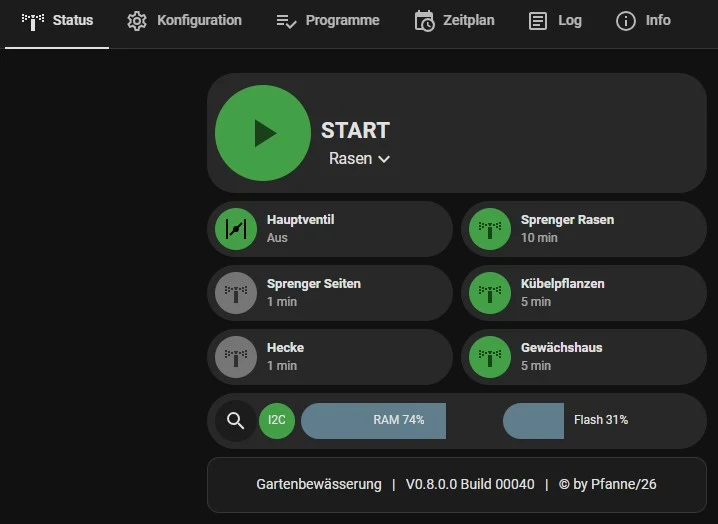 | 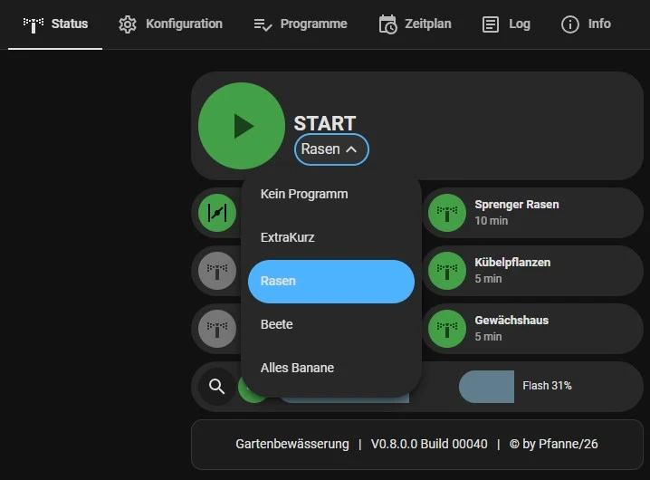 | 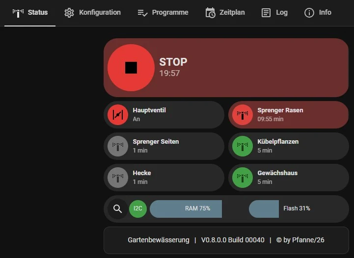 |

**Konfiguration** — Ein globaler Schieberegler setzt die maximale Laufzeit pro Ventil; überschreitet die individuelle Laufzeit diesen Wert, erscheint eine Warnzeile. Für jedes Ventil ein editierbares Textfeld (Alias) und ein Laufzeit-Schieberegler, Änderungen wirken sofort. Kein Automatik-Schalter hier — das läuft ausschließlich über Programme.

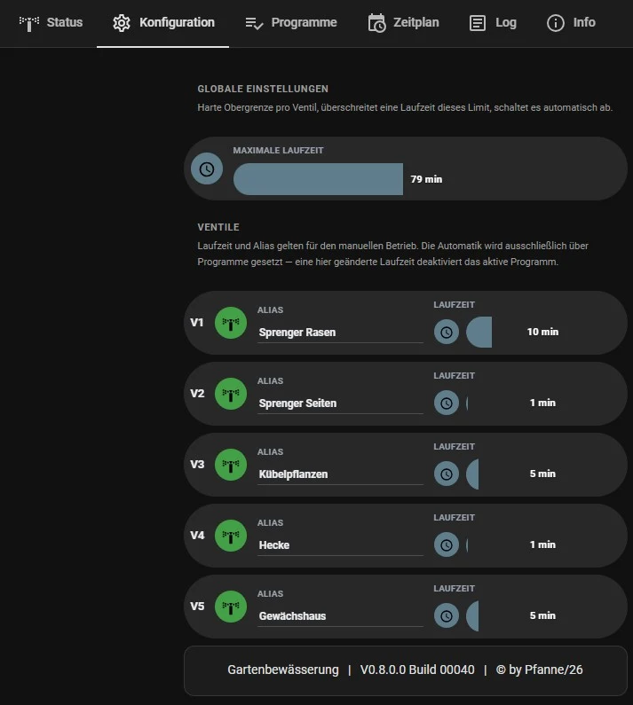

**Programme** — Liste aller Programme mit Name und aktiven-Ventile-Zusammenfassung, je Eintrag Aktivieren/Bearbeiten/Löschen. „Neues Programm" öffnet einen Editor (Name, je Ventil Auto-Schalter + Laufzeit-Schieberegler) über die Entwurfs-Helper aus 8.4, Speichern/Abbrechen übernimmt bzw. verwirft.

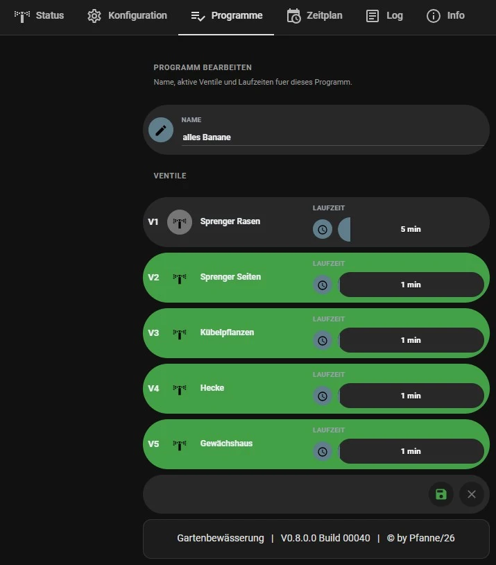

**Zeitplan** — Globaler Schalter „Zeitplan aktiv" oben, darunter alle Einträge mit Programm, Zeittyp und Uhrzeit; Antippen schaltet einen Eintrag einzeln aktiv/pausiert (referenziert der Eintrag ein gelöschtes Programm, erscheint „Programm nicht gefunden!" und die Kachel wird gesperrt). Bearbeiten/Löschen je Eintrag, „Neuer Eintrag" öffnet den Editor (Programm, Typ, Uhrzeit, je nach Typ Datum oder Wochentage).

| Eintragsliste | Eintrag bearbeiten |
|---|---|
| 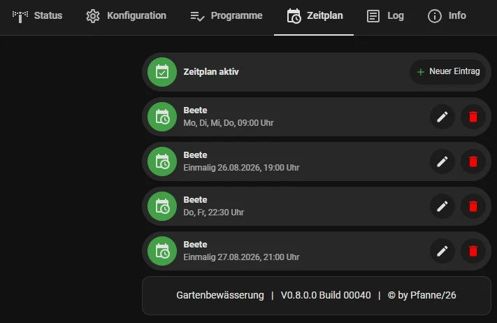 | 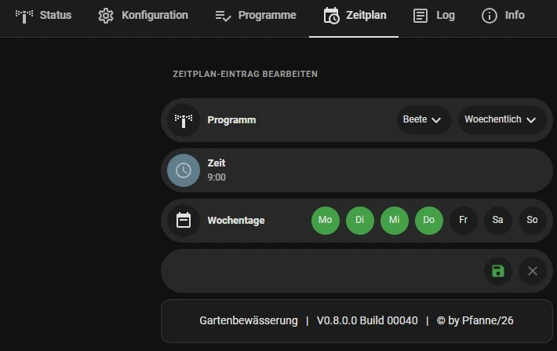 |

**Log** — Kein Nachbau des vollständigen Geräte-Logs (das bleibt dem WebIF vorbehalten, Kapitel 6.5) — stattdessen das Standard-Home-Assistant-Logbuch der letzten 24 Stunden für Automatik-Schalter und alle fünf Ventilschalter, reine Anzeige.

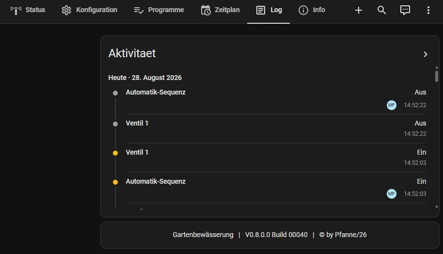

**Info** — Reine Anzeigeseite: Firmware (Version, Uptime, letzter Neustartgrund), Hardware (statische Eckdaten), Speicher (RAM/Flash-Auslastung, freier Stack, Partitionstabelle) und Netzwerk (IP, WLAN-Signalstärke, Broker-Adresse).

| Firmware/Hardware | Speicher/Partitionen/Netzwerk |
|---|---|
| 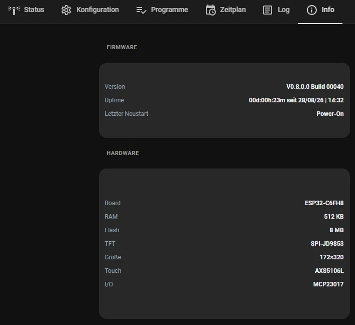 | 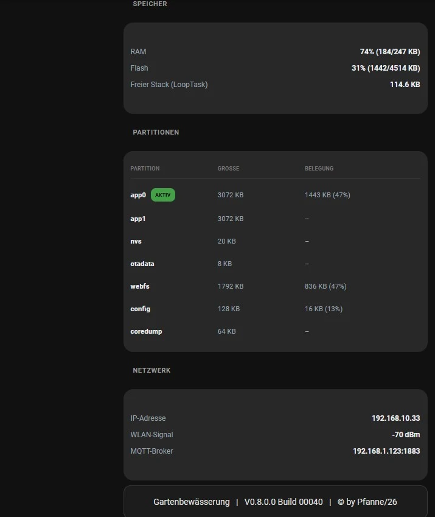 |

---

## 9. Bedienung: openHASP-Touchpanel (Plate)

### 9.1 Überblick

Zusätzlich zum Touch-Display direkt am Gerät (Kapitel 5) lässt sich die Gartenbewässerung auch über ein **separates, per Wand-/Tischhalterung montiertes Touchpanel** bedienen — Hardware-unabhängig vom eigentlichen Steuerungs-Board, angebunden ausschließlich über MQTT + die [openHASP](https://www.openhasp.com/)-Firmware und die Home-Assistant-Integration `openhasp` (Konfiguration: `HomeAssistant/configurations/plates/plate_wz/openhasp.yaml`). Das Panel („`plate_wz`") ist ein Mehrzweck-Gerät — es hostet neben den beiden Gartenbewässerungs-Seiten auch fachfremde Seiten für andere Haussteuerungs-Funktionen (Hauptmenü, Beleuchtung), die hier nicht Teil der Dokumentation sind.

Im Gegensatz zum Geräte-eigenen HMI (172×320px, Kapitel 5) hat das Panel eine deutlich größere Fläche (480×480px) und kann dadurch **mehr Funktionalität** unterbringen — inklusive eines Zeitplan-Editors, den das kleine Geräte-Display bewusst nicht anbietet (Kapitel 5.2).

### 9.2 Status-Seite

Nachbau der wichtigsten WebIF-Status-Funktionen: START/STOP-Button (Automatik-Sequenz), Programm-Auswahl-Dropdown, sechs Ventilkacheln (Hauptventil + V1–V5) mit Live-Restlaufzeit-Text, sowie eine Diagnosezeile (I2C-Status, RAM-/Flash-Auslastung in Prozent). Die Ventilkacheln V1–V5 sind antippbar und schalten das jeweilige Ventil direkt manuell (identische Farblogik wie das Geräte-HMI, Kapitel 5.1: grün = für Automatik vorgesehen, dunkelgrau = nicht vorgesehen, rot = läuft gerade). Das Hauptventil ist reine Anzeige (grau bei Geräte-offline oder „Kein Programm" gewählt, sonst rot/grün je nach Zustand — identische Logik wie auf dem HA-Dashboard, Kapitel 8.6).

| Ruhezustand | Programmwahl | Laufende Automatik |
|---|---|---|
| 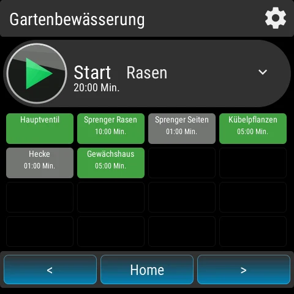 | 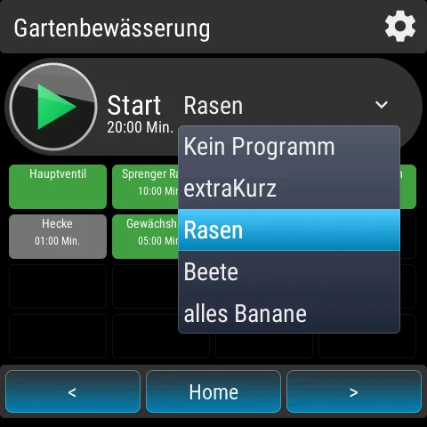 | 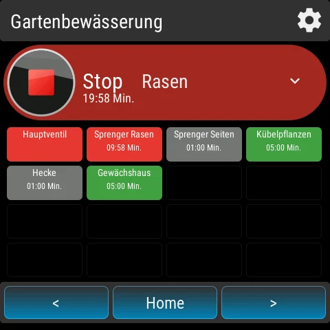 |

Geht das Gerät offline, zeigt die Start-Bubble ein WLAN-Aus-Symbol samt „Offline"-Text statt Start/Stop, die Programmauswahl wird gesperrt.

### 9.3 Settings-Seite

Über das Zahnrad-Icon auf der Status-Seite erreichbar. Drei Kategorien, per Radio-Button-Reihe oben umschaltbar (weißer Rahmen zeigt die aktive Kategorie):

**Konfiguration** — Ventil-Pager (`‹`/`›` blättert durch V1–V5, zeigt Alias groß + Ventilnummer klein, **nur Anzeige, nicht editierbar**) plus ein `-`/`+`-Stepper für die zugehörige Standard-Laufzeit (0–180 min, geteilter Zustand mit der Programme-Kategorie).

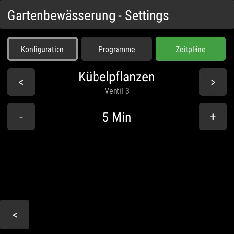

**Programme** — Programm-Pager (blättert durch alle vorhandenen Programme) plus ein zweiter Pager, der gleichzeitig als AUTO-Umschalter für das aktuell gewählte Ventil innerhalb dieses Programms dient (Antippen der Mitte schaltet um, grün = an), darunter ein Laufzeit-Stepper (funktioniert unabhängig vom AUTO-Zustand). **Nur bestehende Programme editierbar** — Anlegen, Umbenennen oder Löschen eines Programms ist auf dem Panel nicht möglich, dafür WebIF (6.3) oder HA-Dashboard (8.6) nutzen.

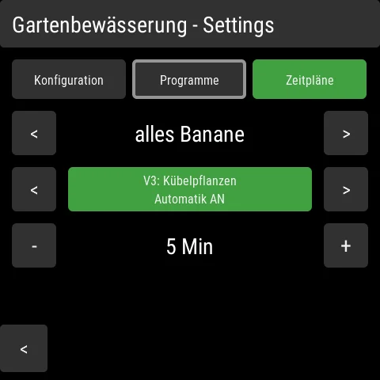

**Zeitpläne** — Eintrags-Auswahl-Dropdown oben (zeigt „Programmname – wann", z. B. „extraKurz – Di, Do, Sa, 07:00 Uhr"), daneben ein Programm-Dropdown und ein AKTIV/PAUSIERT-Umschalter für den gewählten Eintrag. Darunter Modus-Auswahl (Täglich/Wöchentlich/Einmalig als drei Buttons), darunter je nach Modus eine Zeit- oder Datumseinstellung sowie bei „Wöchentlich" eine Wochentagsreihe (Mo–So, einzeln antippbar). Zeit und Datum lassen sich **feldweise** einstellen: Antippen von Stunde/Minute bzw. Tag/Monat/Jahr wählt das jeweilige Feld direkt aus (weißer Rahmen zeigt die Auswahl), die `‹`/`›`-Pfeile verändern gezielt nur dieses Feld — vermeidet, dass eine große Zeit-/Datumsverschiebung viele einzelne Taps braucht. Ein langer Druck (Long-Press) auf den Kategorie-Button „Zeitpläne" schaltet den **globalen** Zeitplan-Schalter um (unabhängig von der gerade gewählten Kategorie, bleibt als Dauerzustand grün sichtbar, solange aktiv). **Nur bestehende Einträge editierbar** — Anlegen oder endgültiges Löschen eines Zeitplan-Eintrags ist auf dem Panel nicht möglich, dafür WebIF (6.4) oder HA-Dashboard (8.6) nutzen.

Modus-abhängige Darstellung — Täglich (nur Zeit), Wöchentlich (Zeit + Wochentage), Einmalig (Zeit + Datum), sowie die geöffnete Eintrags-Auswahl:

| Täglich | Wöchentlich | Einmalig | Eintrags-Auswahl |
|---|---|---|---|
| 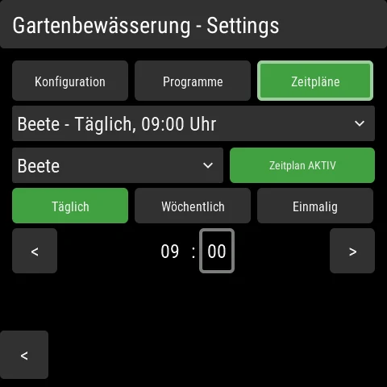 | 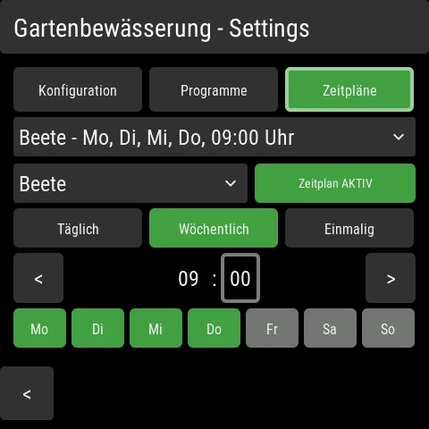 | 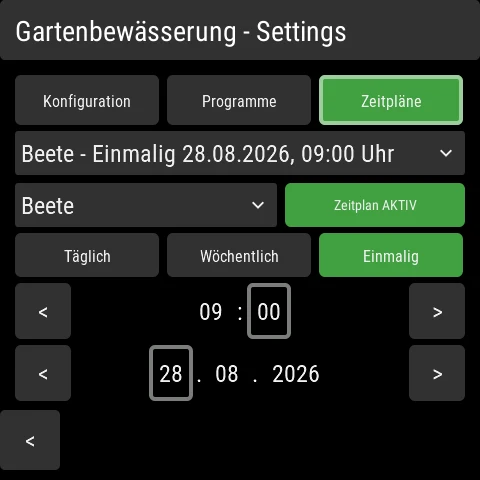 | 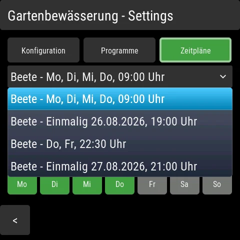 |

Auch hier: unten rechts erscheint bei Geräte-Ausfall der Hinweis „Device ist offline!" (rot).

---

## 10. Gesamtübersicht aller Bedienwege

Vier eigenständige Oberflächen plus die zugrundeliegende MQTT-Schnittstelle stehen zur Wahl — je nach Situation ist ein anderer Weg am praktischsten (schneller Tap vor Ort vs. vollständige Konfiguration vs. Sprachsteuerung/Automatisierung über Home Assistant). Alle greifen auf denselben Gerätezustand zu.

| Funktion | Geräte-HMI (5) | Geräte-WebIF (6) | HA-Dashboard (8.6) | openHASP-Plate (9) | MQTT (7) |
|---|:---:|:---:|:---:|:---:|:---:|
| Ventil V1–V5 manuell schalten | ✅ | ✅ | ✅ | ✅ | ✅ |
| Hauptventil-Status ansehen | ✅ | ✅ | ✅ (nur Anzeige) | ✅ (nur Anzeige) | ✅ |
| Automatik Start/Stop | ✅ | ✅ | ✅ | ✅ | ✅ |
| Programm auswählen/aktivieren | ✅ | ✅ | ✅ | ✅ | ✅ |
| Programm anlegen/umbenennen/löschen | ❌ | ✅ | ✅ | ❌ | ✅ |
| Programm bearbeiten (Ventile/Laufzeiten) | ❌ | ✅ | ✅ | ✅ (nur bestehende) | ✅ |
| Ventil-Alias bearbeiten | ❌ | ✅ | ✅ | ❌ (nur Anzeige) | ✅ |
| Ventil-Laufzeit bearbeiten | ❌ | ✅ | ✅ | ✅ | ✅ |
| Globale Obergrenze (`maxTime`) bearbeiten | ❌ | ✅ | ✅ | ❌ | ✅ |
| Zeitplan-Eintrag anlegen/löschen | ❌ | ✅ | ✅ | ❌ | ✅ |
| Zeitplan-Eintrag bearbeiten | ❌ | ✅ | ✅ | ✅ (nur bestehende) | ✅ |
| Zeitplan-Eintrag einzeln aktiv/pausiert | ❌ | ✅ | ✅ | ✅ | ✅ |
| Zeitplan global aktiv/pausiert | ❌ | ✅ | ✅ | ✅ (Long-Press) | ✅ |
| Live-Restlaufzeit ansehen | ✅ | ✅ | ✅ | ✅ | ✅ |
| Diagnose (I2C/RAM/Flash/Version) | ⚠️ nur I2C-Fehler | ✅ vollständig | ✅ vollständig | ✅ vollständig | ✅ |
| Vollständiges Live-Log mitlesen | ❌ | ✅ | ❌ (nur 24h-Logbuch) | ❌ | ✅ (`diagnostics/livelog`) |
| Firmware-/WebIF-Update einspielen | ❌ | ✅ | ❌ | ❌ | ❌ (nur per PlatformIO, Kap. 11.2/11.3) |
| Geräte-Offline erkennen | n/a | n/a (nur erreichbar wenn online) | ✅ | ✅ | ✅ (`availability`) |

✅ = voll unterstützt · ⚠️ = eingeschränkt · ❌ = nicht verfügbar · n/a = nicht zutreffend

---

## 11. Firmware-Updates

Drei gleichwertige Wege, ein Firmware- oder Web-Interface-Update einzuspielen:

### 11.1 Über das Web-Interface (ohne Entwicklungsumgebung)

Empfohlen für alle, die keine Entwicklungsumgebung installiert haben. Web-Interface → *Update* → Datei auswählen (`firmware.bin` bzw. das Web-Dateisystem-Image) → Hochladen. Firmware und Dateisystem werden unabhängig voneinander aktualisiert. Nach erfolgreichem Upload startet das Gerät automatisch neu.

### 11.2 Per Kabel (USB, PlatformIO)

```
pio run -e esp32-c6-devkitc-1 --target upload      # Firmware
pio run -e esp32-c6-devkitc-1 --target uploadfs    # Web-Interface-Dateien
```

### 11.3 Kabellos über WLAN (PlatformIO, für Entwickler)

```
pio run -e esp32-c6-devkitc-1-ota --target upload      # Firmware
pio run -e esp32-c6-devkitc-1-ota --target uploadfs    # Web-Interface-Dateien
```

Voraussetzung: Gerät läuft bereits und ist im WLAN erreichbar (mDNS-Name `gartenwasser.local`).

### 11.4 Version prüfen

Nach jedem Update lässt sich die tatsächlich laufende Version im Web-Interface unter *Info* → *Firmware* ablesen (Format „V<Version> Build <Nummer>") — die Build-Nummer zählt bei jedem Firmware-Build automatisch hoch, unabhängig von der manuell vergebenen Versionsnummer.

### 11.5 Code-Struktur nachvollziehen (für Entwickler)

Wer sich im Firmware-Quelltext (`src/`) orientieren will, statt nur ein fertiges Update einzuspielen: [Doxygen](https://www.doxygen.nl/) + [Graphviz](https://graphviz.org/) erzeugen daraus automatisch Klassendiagramme, Aufruf-/Aufrufer-Graphen und Include-Abhängigkeitsgraphen. Fertig generiert, direkt gerendert (nicht nur als Quelltext): **[Code-Struktur durchsuchen](https://pfannex.github.io/Gartenwasser/doxygen/html/index.html)**. Installation, Konfiguration (`tools/doxygen/Doxyfile`) und Regenerieren nach Code-Änderungen: `docs/development.md`.

---

## 12. Anhang: Fehlerbehebung

| Symptom | Mögliche Ursache | Lösung |
|---|---|---|
| Display bleibt schwarz | Backlight/Display-Init fehlgeschlagen | Live-Log prüfen (`ERROR/HMI: Display-Init fehlgeschlagen`), Gerät neu starten |
| Ventile schalten nicht | I2C-Bus/MCP23017 nicht erreichbar | Web-Interface → Status → I2C-Bus-Anzeige; Verkabelung prüfen (Kapitel 3) |
| Web-Interface zeigt „Getrennt" | Keine MQTT-Verbindung vom Browser | Broker-Erreichbarkeit prüfen (Browser muss den WebSocket-Port erreichen können, standardmäßig 9001) |
| START-Button gesperrt (Touch) | Kein Programm gewählt | Über den Programme-Button ein Programm auswählen |
| Automatik startet nicht trotz gewähltem Programm | Kein Ventil im Programm mit `auto = ON` | Programm im Web-Interface prüfen/bearbeiten |
| OTA-Update über PlatformIO schlägt fehl („No response from device") | Meist ein einmaliger Timing-Effekt direkt nach einem vorherigen Reset | Kurz warten, erneut versuchen |
| Zeitplan-Eintrag löst nicht aus | Globaler Zeitplan-Schalter aus, oder referenziertes Programm gelöscht | Web-Interface → Zeitplan prüfen |

Bei tiefergehenden Problemen: Web-Interface → *Log* öffnet den kompletten Live-Mitschnitt des Geräts inklusive der letzten Boot-Sequenz.
