# Gartenwasser — Benutzerhandbuch

Automatische Gartenbewässerung auf ESP32-C6-Basis mit Touch-Display, Web-Interface und MQTT/Home-Assistant-Anbindung.

**Firmware-Version:** siehe `include/Version.h` bzw. Web-Interface → *Info* → *Firmware*
**Stand dieses Dokuments:** 2026-08-19

---

## Inhalt

1. [Überblick](#1-überblick)
2. [Hardware](#2-hardware)
3. [Schaltplan / Verkabelung](#3-schaltplan--verkabelung)
4. [Inbetriebnahme](#4-inbetriebnahme)
5. [Bedienung: Touch-Display (HMI)](#5-bedienung-touch-display-hmi)
6. [Bedienung: Web-Interface](#6-bedienung-web-interface)
7. [MQTT-Schnittstelle](#7-mqtt-schnittstelle)
8. [Home-Assistant-Integration](#8-home-assistant-integration)
9. [Firmware-Updates](#9-firmware-updates)
10. [Anhang: Fehlerbehebung](#10-anhang-fehlerbehebung)

---

## 1. Überblick

Die Gartenwasser-Steuerung schaltet bis zu 5 Bewässerungsventile (`V1`–`V5`) plus ein gemeinsames Hauptventil (`V0`), das automatisch mitgeschaltet wird, sobald mindestens ein Bewässerungsventil aktiv ist. Drei gleichwertige Bedienwege stehen zur Verfügung:

| Weg | Wofür geeignet |
|---|---|
| **Touch-Display** (Kapitel 5) | Schnelle Vor-Ort-Bedienung: Start/Stop, Ventile einzeln schalten, Programm wählen |
| **Web-Interface** (Kapitel 6) | Vollständige Konfiguration: Programme/Zeitplan anlegen, Live-Log, Firmware-Update |
| **MQTT** (Kapitel 7) | Automatisierung, Home Assistant, eigene Skripte |

Alle drei Wege greifen auf denselben Zustand zu — eine Änderung über einen Weg erscheint sofort auf den anderen (z. B. schaltet ein Touch-Tap am Display auch `V1/state` per MQTT).

**Programme vs. manuelle Bedienung:** Ein *Programm* legt fest, welche Ventile mit welcher Laufzeit an der nächsten Automatik-Sequenz teilnehmen (`auto`-Flag + `time` je Ventil). Ändert man `time` oder `auto` direkt (ohne ein Programm zu wählen), springt die Anzeige automatisch auf „Manueller Modus" — das verhindert, dass eine Änderung beim nächsten Automatikstart stillschweigend überschrieben wird.

---

## 2. Hardware

### 2.1 Steuerungseinheit

**Board:** Waveshare ESP32-C6-Touch-LCD-1.47

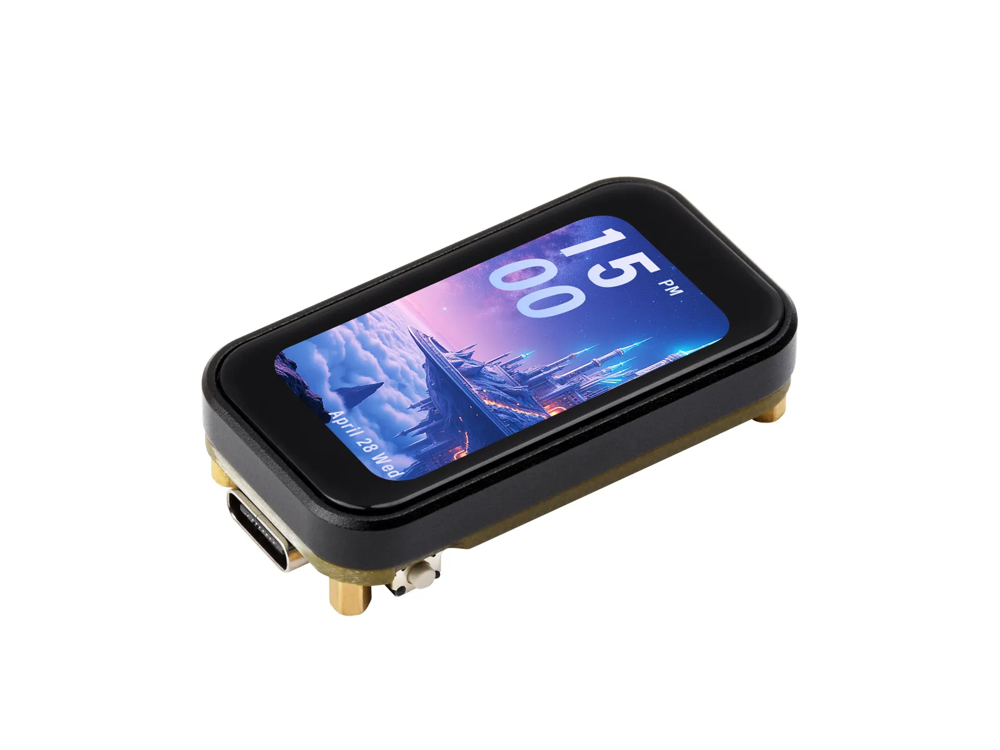

| Merkmal | Wert |
|---|---|
| Chip | ESP32-C6FH8 (RISC-V, 160 MHz High-Performance-Core + 20 MHz Low-Power-Core) |
| RAM | 512 KB High-Performance-SRAM + 16 KB Low-Power-SRAM |
| Flash | 8 MB (onboard) |
| Display | 1.47″ IPS-LCD, 172×320 Pixel, Treiber JD9853, SPI |
| Touch | Kapazitiv, Controller AXS5106L, I2C |
| Anschluss | USB-C (Programmierung, Stromversorgung) |

Quelle Board-Daten: [Waveshare-Produktdokumentation](https://docs.waveshare.com/ESP32-C6-Touch-LCD-1.47).

**Maße:**

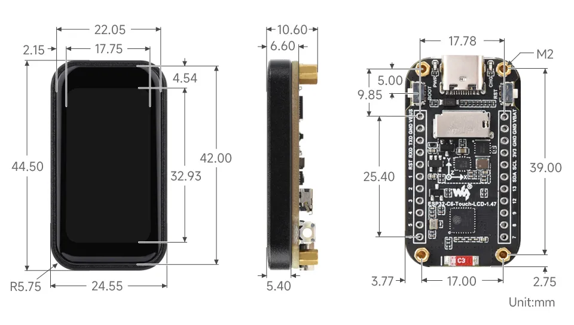

### 2.2 Ventile / Relais

6 Relaisausgänge (`V0`–`V5`), angesteuert über einen I2C-GPIO-Erweiterungsbaustein (siehe 2.3) — nicht direkt vom ESP32, da dessen GPIOs bereits für Display/Touch belegt sind. `V0` ist das Hauptventil und wird von der Firmware automatisch mitgeschaltet, sobald irgendein Ventil `V1`–`V5` aktiv ist (bzw. ausgeschaltet, sobald keins mehr läuft) — es muss nicht separat angesteuert werden.

Ein externes Relaismodul (6 Kanäle, potentialfrei) wird zwischen MCP23017-Ausgängen und den eigentlichen Magnetventilen benötigt — welches Modul konkret verbaut ist, hängt vom Aufbau ab und ist hier nicht Teil der Firmware-Dokumentation.

### 2.3 I/O-Erweiterung: MCP23017

16-Bit-I2C-GPIO-Expander (Microchip), stellt die 6 Ventil-Ausgänge auf Port B bereit. Adresse `0x20` (Adresspins A0–A2 alle auf GND). Teilt sich den I2C-Bus mit dem Touch-Controller (siehe Kapitel 3).

| Ventil | MCP23017-Pin (GPB) | Chip-Pin # |
|---|---|---|
| V0 (Hauptventil) | GPB7 | 4 |
| V1 | GPB2 | 27 |
| V2 | GPB3 | 28 |
| V3 | GPB4 | 1 |
| V4 | GPB5 | 2 |
| V5 | GPB6 | 3 |

---

## 3. Schaltplan / Verkabelung

Display und Touch-Controller sind bereits fest auf dem Waveshare-Board verdrahtet — hier nur relevant für die I2C-Bus-Zuordnung. Der MCP23017 ist ein separates, extern angeschlossenes Bauteil.

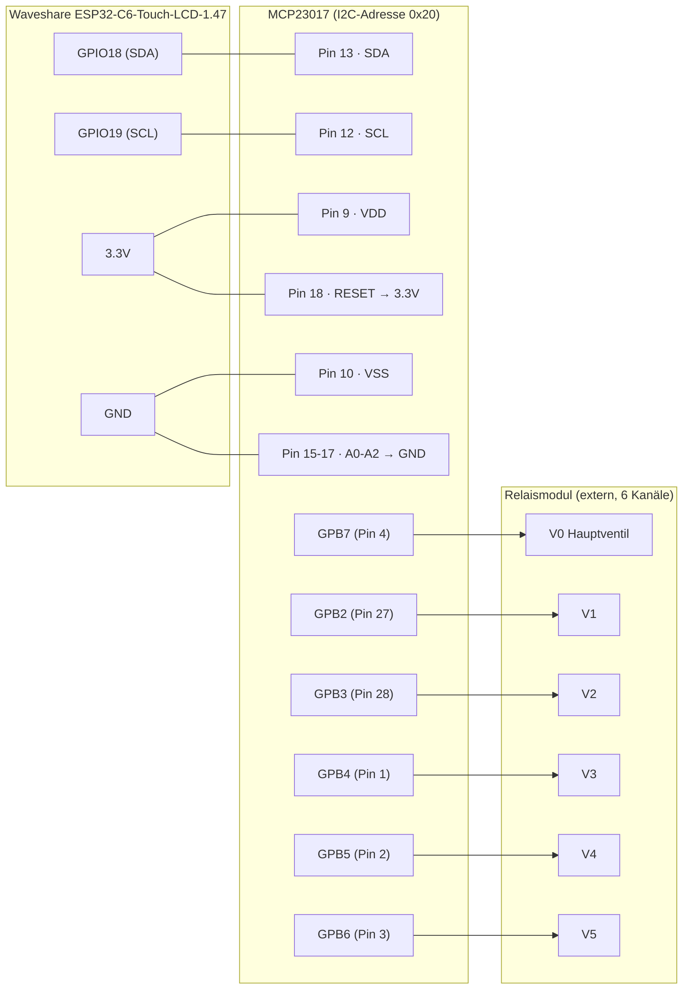
```mermaid
graph LR
    subgraph ESP["Waveshare ESP32-C6-Touch-LCD-1.47"]
        G18["GPIO18 (SDA)"]
        G19["GPIO19 (SCL)"]
        G3V["3.3V"]
        GGND["GND"]
    end

    subgraph MCP["MCP23017 (I2C-Adresse 0x20)"]
        M13["Pin 13 · SDA"]
        M12["Pin 12 · SCL"]
        M9["Pin 9 · VDD"]
        M10["Pin 10 · VSS"]
        M1517["Pin 15-17 · A0-A2 → GND"]
        M18["Pin 18 · RESET → 3.3V"]
        MB7["GPB7 (Pin 4)"]
        MB2["GPB2 (Pin 27)"]
        MB3["GPB3 (Pin 28)"]
        MB4["GPB4 (Pin 1)"]
        MB5["GPB5 (Pin 2)"]
        MB6["GPB6 (Pin 3)"]
    end

    subgraph REL["Relaismodul (extern, 6 Kanäle)"]
        R0["V0 Hauptventil"]
        R1["V1"]
        R2["V2"]
        R3["V3"]
        R4["V4"]
        R5["V5"]
    end

    G18 --- M13
    G19 --- M12
    G3V --- M9
    G3V --- M18
    GGND --- M10
    GGND --- M1517
    MB7 --> R0
    MB2 --> R1
    MB3 --> R2
    MB4 --> R3
    MB5 --> R4
    MB6 --> R5
```

**Hinweis Touch/Display-Pins** (bereits auf dem Board verdrahtet, nur zur Referenz):

| Funktion | GPIO |
|---|---|
| LCD Clock (SCK) | 1 |
| LCD Data (MOSI) | 2 |
| LCD Chip-Select | 14 |
| LCD Data/Command | 15 |
| LCD Reset | 22 |
| LCD Backlight | 23 |
| Touch SDA | 18 (geteilt mit MCP23017) |
| Touch SCL | 19 (geteilt mit MCP23017) |
| Touch Reset | 20 |
| Touch Interrupt | 21 |

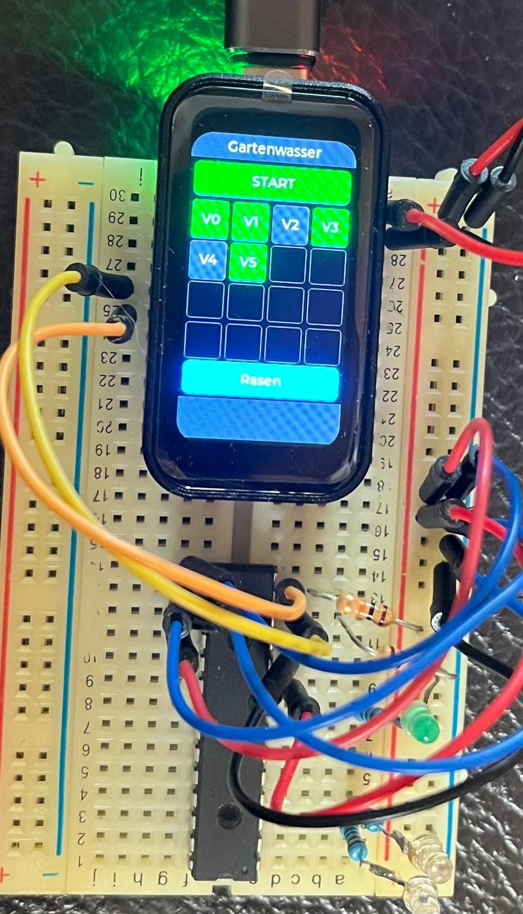

Testaufbau: MCP23017 (schwarzer DIP-Chip, mittig), Test-LEDs anstelle der eigentlichen Relais/Ventile, Display/Touch-Board oben aufgesteckt.

---

## 4. Inbetriebnahme

### 4.1 Voraussetzungen

- WLAN-Zugangsdaten (2,4 GHz) und ein erreichbarer MQTT-Broker (unterstützt Standard-MQTT **und** MQTT-over-WebSocket, da das Web-Interface direkt per WebSocket mit dem Broker spricht).
- Für die Erstinbetriebnahme: USB-C-Kabel + PC mit [PlatformIO](https://platformio.org/).

### 4.2 Zugangsdaten hinterlegen

WLAN- und MQTT-Zugangsdaten liegen in `include/secrets.h` (aus `include/secrets.h.example` kopieren und anpassen, nicht Teil des Repositories/versioniert).

### 4.3 Erstes Flashen

```
pio run -e esp32-c6-devkitc-1 --target upload      # Firmware
pio run -e esp32-c6-devkitc-1 --target uploadfs    # Web-Interface-Dateien
```

Nach dem ersten erfolgreichen Boot ist das Gerät auch kabellos erreichbar (siehe Kapitel 9).

### 4.4 MQTT-Broker: WebSocket-Zugang für den Browser einrichten

Das Web-Interface verbindet sich **direkt** aus dem Browser per MQTT-over-WebSocket mit dem Broker (siehe Kapitel 1/6) — nicht über einen Umweg über den ESP32. Ein Browser kann aber keine rohe TCP-Verbindung auf den üblichen MQTT-Port 1883 öffnen, dafür braucht der Broker zusätzlich einen **WebSocket-Listener**. Das ist eine einmalige, vom Gerät unabhängige Einrichtung direkt auf dem Broker — ohne sie bleibt das Web-Interface dauerhaft auf „Getrennt“, während MQTT-Clients wie mqtt-spy oder Home Assistant (die den normalen Port 1883 nutzen) ganz normal funktionieren.

Für Mosquitto (ab Version 1.6) genügt eine zusätzliche Konfigurationsdatei, zum Beispiel `/etc/mosquitto/conf.d/websockets.conf`:

```
listener 9001
protocol websockets
allow_anonymous true
```

`allow_anonymous true` passend zum ohnehin anonymen Standard-Listener wählen (bzw. hier ergänzen, falls dieser bereits Zugangsdaten verlangt). Danach den Broker neu laden (`systemctl restart mosquitto`) und den offenen Port verifizieren (`ss -tlnp | grep 9001`).

Die resultierende Adresse (`ws://<Broker-IP>:9001/mqtt`) steht als `BROKER_WS_URL`-Konstante am Kopf jeder `data/*.js`-Datei (`app.js`, `konfig.js`, `programme.js`, `zeitplan.js`, `log.js`, `info.js`). Ändert sich Broker-IP oder -Port, muss diese Konstante in allen sechs Dateien angepasst und per `pio run --target uploadfs` neu ausgeliefert werden. Zusätzlich muss jedes Gerät, das das Web-Interface im Browser öffnet (PC, Smartphone, Tablet), Netzwerkzugriff auf diesen Port haben — genau wie auf die IP-Adresse des ESP32 selbst.

### 4.5 Erste Schritte danach

1. Web-Interface öffnen (`http://<Geräte-IP>/` — IP steht z. B. im Router oder auf der *Info*-Seite, siehe 6.7).
2. Unter *Konfiguration* Ventil-Aliasnamen vergeben und Laufzeiten prüfen.
3. Unter *Programme* mindestens ein Programm anlegen (ohne Programm kann die Automatik nicht gestartet werden — siehe 6.3).
4. Optional: Zeitplan-Einträge anlegen (Kapitel 6.4).

---

## 5. Bedienung: Touch-Display (HMI)

### 5.1 Hauptseite

| Ruhezustand | Laufende Automatik |
|---|---|
| 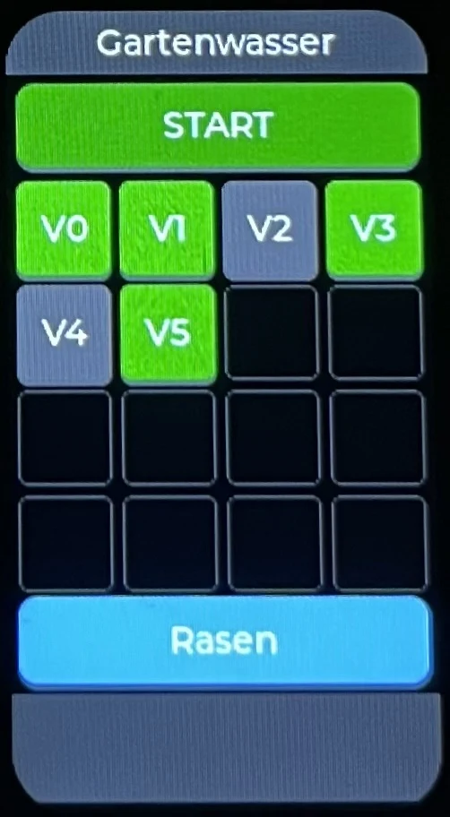 | 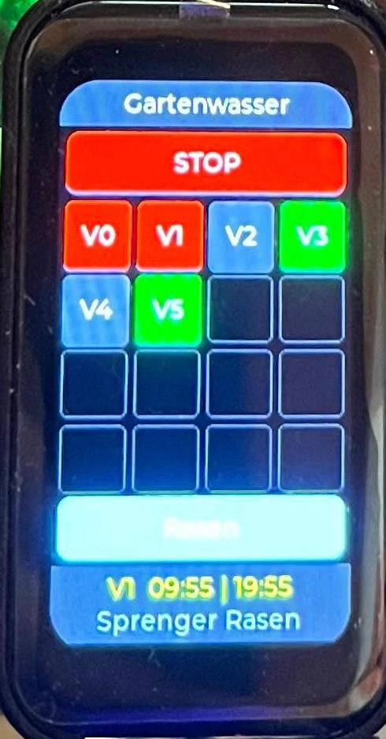 |

Aufbau von oben nach unten: Titelzeile, START/STOP-Button (volle Breite), Ventil-Matrix (4×4, `V0`–`V5` belegt, Rest Platzhalter für eine spätere Erweiterung), Programme-Button, zweizeilige Statuszeile.

**START/STOP:** Startet/stoppt die Automatik-Sequenz für das aktuell gewählte Programm. Ohne gewähltes Programm ist der Button gesperrt (ausgegraut) — ein Programm muss zuerst über den Programme-Button gewählt werden.

**Ventil-Matrix:** `V1`–`V5` sind antippbar und schalten das jeweilige Ventil sofort manuell (nicht während einer laufenden Automatik — das wird ignoriert). Farblogik:
- **Grün:** Ventil aus, für Automatik vorgesehen (`auto = ON`)
- **Dunkelgrau:** Ventil aus, nicht Teil der Automatik
- **Rot:** Ventil aktiv (läuft gerade)

`V0` (Hauptventil) hat keine eigene Tap-Funktion — es folgt automatisch `V1`–`V5`.

**Programme-Button:** Zeigt den Namen des aktiven Programms, bzw. „Manueller Modus", wenn keins gewählt ist. Tippen öffnet die Programme-Unterseite. Während einer laufenden Automatik gesperrt.

**Statuszeile** (Fußleiste, zeigt je nach Zustand):
1. I2C-Fehler (rot/gelb) — höchste Priorität
2. Laufende Automatik: aktives Ventil + Restlaufzeit `V{n} mm:ss | mm:ss` (aktuelles Ventil | Gesamtrest)
3. Manuell geschaltetes Ventil: „MANUELL" + Alias-Name
4. Sonst leer

### 5.2 Programme-Unterseite

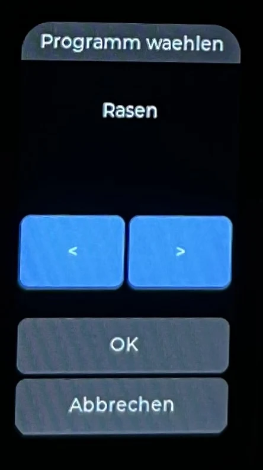

Über den Programme-Button erreichbar. `‹`/`›` blättert durch alle angelegten Programme (inkl. „Kein Programm"). **OK** wendet das durchgeblätterte Programm an — startet aber **nichts**, der Start bleibt ein separater Schritt über den START-Button auf der Hauptseite. **Abbrechen** verwirft die Auswahl.

> Der Zeitplan (wiederkehrende Automatik-Termine) lässt sich **nicht** am Display bearbeiten — dafür ist das 172×320px-Display zu klein. Das läuft ausschließlich über das Web-Interface (Kapitel 6.5).

---

## 6. Bedienung: Web-Interface

Erreichbar über `http://<Geräte-IP>/` im Browser (Smartphone, Tablet, PC — kein Login nötig). Der Browser verbindet sich für alle Live-Daten direkt per MQTT-over-WebSocket mit dem Broker; das Gerät liefert nur die statischen Seiten aus. Alle sieben Seiten teilen sich dieselbe Navigationsleiste oben.

### 6.1 Status (Startseite)

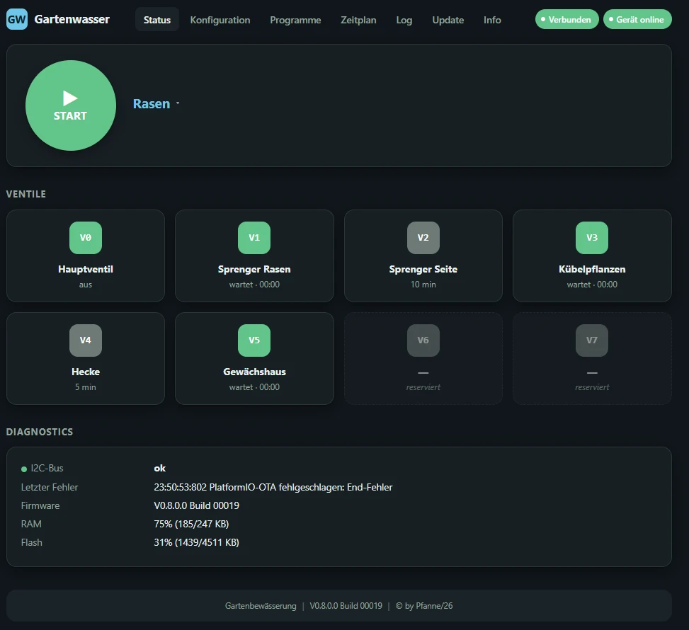

Übersicht: START/STOP-Button + Programmwahl im Hero-Bereich, „Nächster Termin" (nächster Zeitplan-Trigger, im Browser berechnet), Ventilkacheln mit Live-Status/Restlaufzeit, sowie eine Diagnostics-Karte (I2C-Status, letzter Fehler, Firmware-Version, RAM/Flash-Auslastung).

### 6.2 Konfiguration

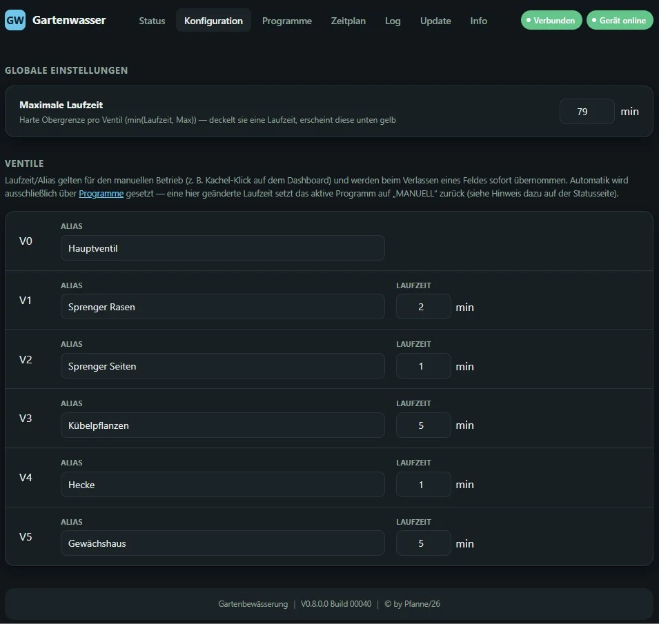

Editierbar je Ventil: **Alias** (Klartextname) und **Laufzeit** (`time`, Minuten). Zusätzlich global: **maxTime** (Obergrenze pro Ventil — die tatsächlich verwendete Laufzeit ist `min(time, maxTime)`, überschrittene Werte werden gelb markiert).

> Das `auto`-Flag (Teilnahme an der Automatik) ist hier **nicht** mehr editierbar — das läuft ausschließlich über Programme (Kapitel 6.3). Jede Änderung von `time` an dieser Stelle setzt die Programmwahl automatisch auf „Manueller Modus" zurück (siehe Kapitel 1).

### 6.3 Programme

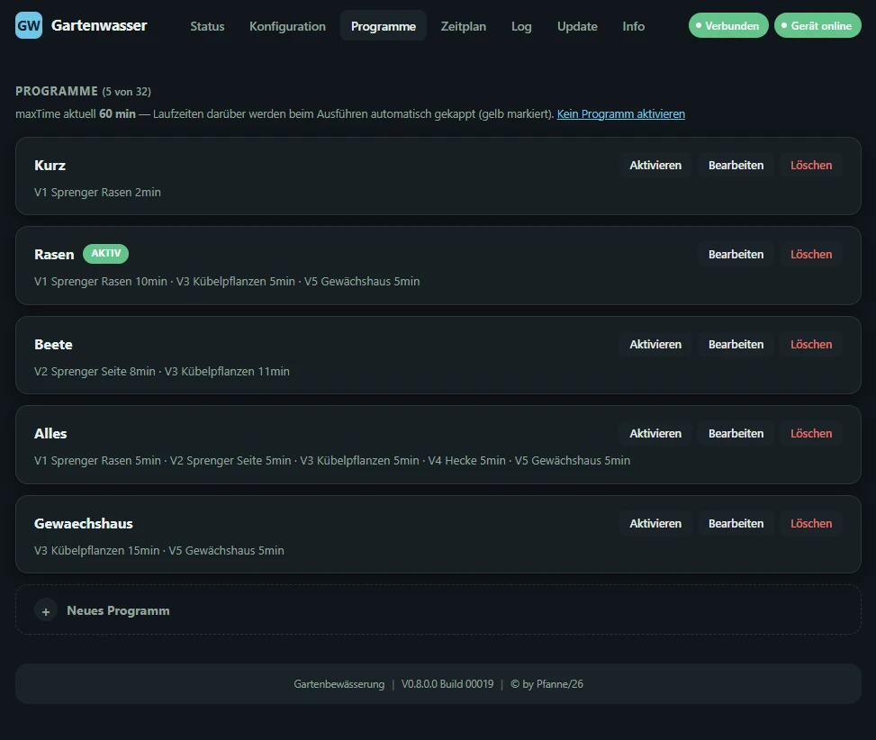

Bis zu 32 Programme, jeweils mit Name + je Ventil `time`/`auto`. Karten-Ansicht mit Aktivieren/Bearbeiten/Löschen.

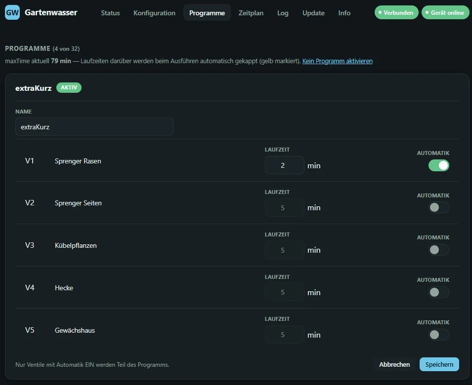

Der Editor zeigt für jedes Ventil einen Automatik-Schalter und ein Laufzeit-Feld — nur Ventile mit Automatik EIN werden Teil der Sequenz beim Start.

### 6.4 Zeitplan

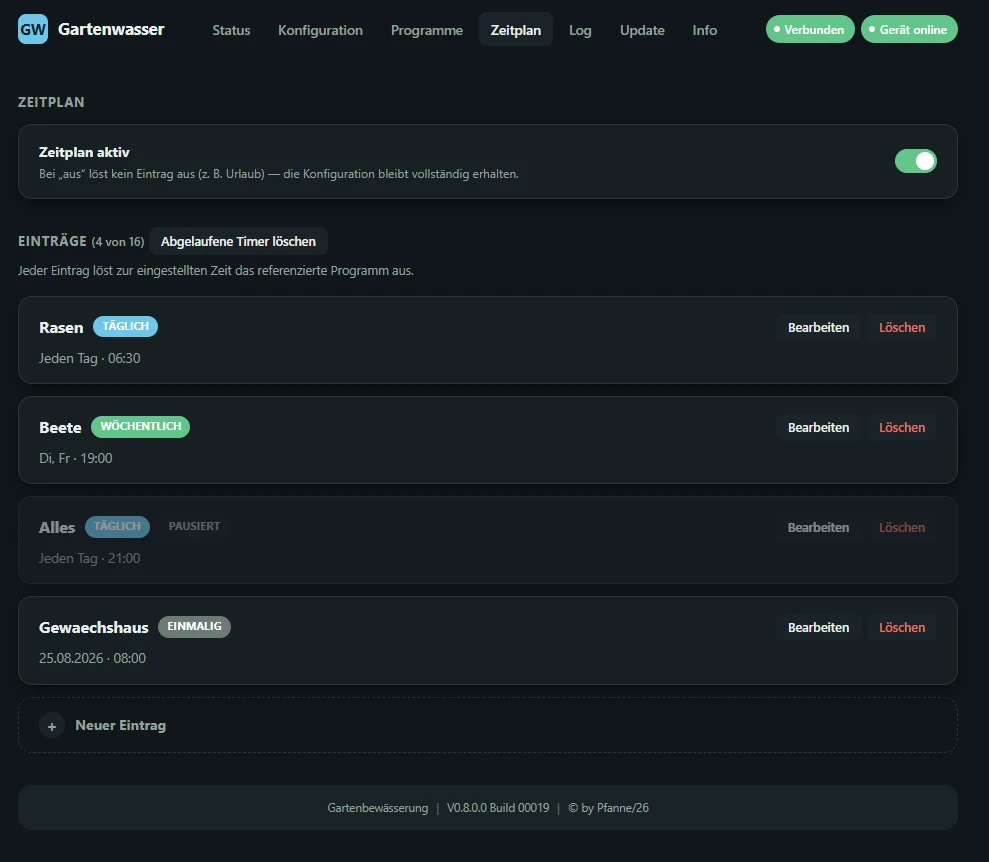

Bis zu 16 Einträge, je Eintrag: verknüpftes Programm (per Name), Trigger-Typ (**täglich**, **wöchentlich** mit Wochentagsauswahl, oder **einmalig** mit Datum), Uhrzeit, aktiv/pausiert. Globaler Schalter „Zeitplan aktiv" (z. B. für Urlaub — deaktiviert alle Trigger, ohne die Konfiguration zu löschen). Abgelaufene „einmalig"-Termine lassen sich über einen Button gesammelt entfernen.

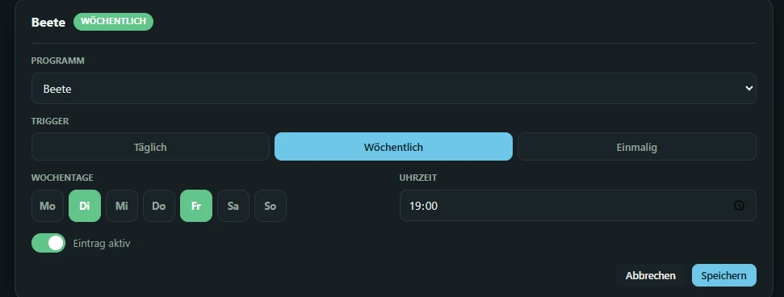

### 6.5 Log

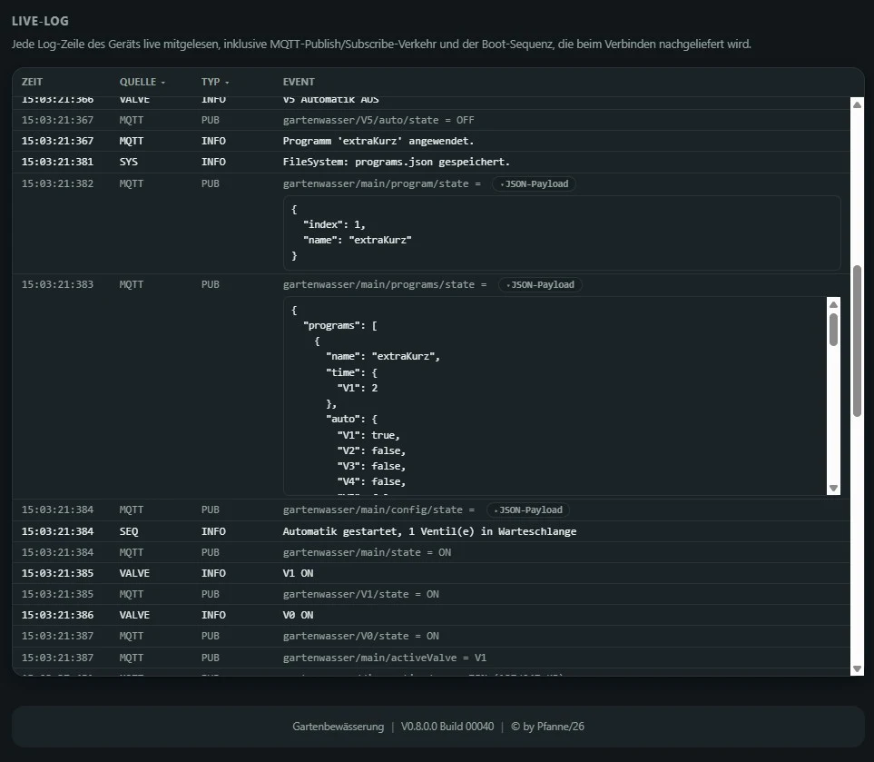

Live-Mitschnitt aller Logmeldungen des Geräts (inklusive der Boot-Sequenz und allem MQTT-Publish-/Subscribe-Verkehr). Filterbar nach Quelle und Typ (Fehler/Info/Debug/Publish/Subscribe), Volltextsuche über die Event-Spalte. JSON-Nutzlasten (z. B. Konfigurationsstände) lassen sich über einen „JSON-Payload"-Button einzeln aufklappen.

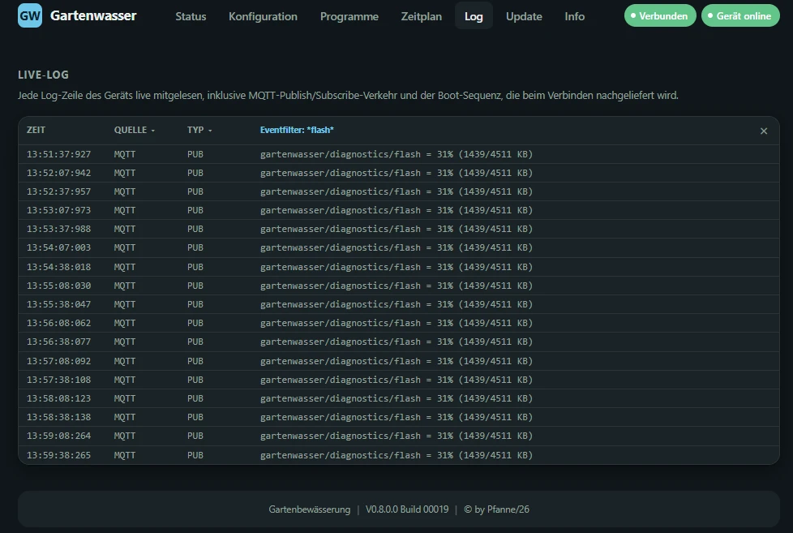

Die Event-Spaltenüberschrift wird per Klick zum Live-Suchfeld — hier gefiltert auf „flash".

### 6.6 Update

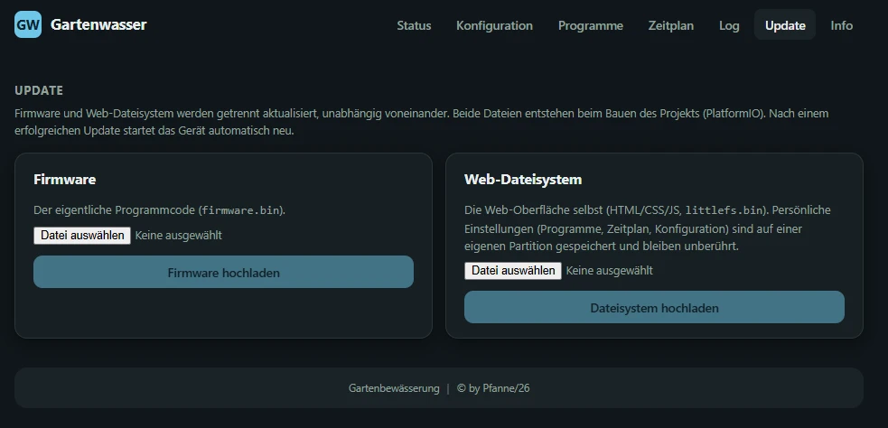

Firmware- und Dateisystem-Update direkt aus dem Browser, ohne Entwicklungsumgebung — siehe Kapitel 9.

### 6.7 Info

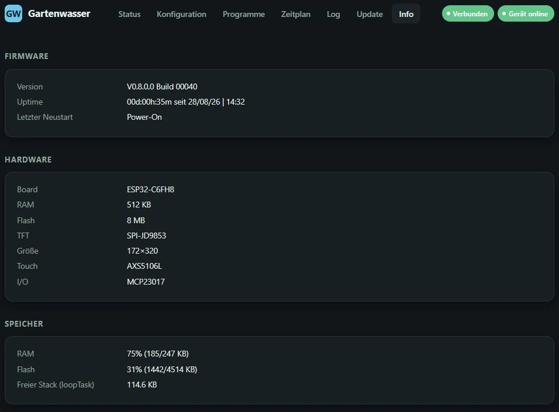

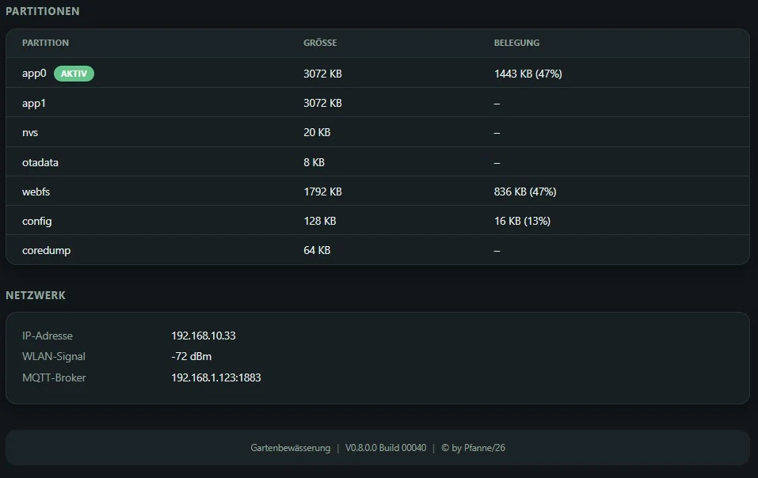

Gruppierte Hardware-/Systeminformationen: Firmware-Version + Build-Nummer + Uptime + letzter Neustart-Grund, Speicher (RAM/Flash/freier Stack), Partitionstabelle mit Belegung, Netzwerk (IP, WLAN-Signalstärke, MQTT-Broker), sowie feste Hardware-Eckdaten (Board/RAM/Flash/Display/Touch/I-O, siehe Kapitel 2).

---

## 7. MQTT-Schnittstelle

Alle Topics beginnen mit `gartenwasser/`. `retain=ja` bedeutet: der letzte Wert bleibt beim Broker gespeichert, ein neu verbundener Client bekommt ihn sofort.

### 7.1 Gesamter Topic-Baum

```
TOPIC                   | RETAIN | VALUE                        | BEDEUTUNG
---------------------------------------------------------------------------
gartenwasser/           |        |                              |
├── availability        | ja     | online|offline               | Last Will (Verbindungsstatus)
├── V0/                 |        |                              |
│   ├── state           | ja     | ON|OFF                       | read-only, folgt V1-V5
│   ├── alias           | ja     | "Hauptventil"                | Klartextname
│   └── alias/set       | nein   | "Text"                       | Alias-Namen editieren
├── V1/ .. V5/          |        |                              |
│   ├── state           | ja     | ON|OFF                       | read-only, Ist-Zustand
│   ├── cmd             | nein   | ON|OFF                       | Ventil schalten
│   ├── alias           | ja     | "Rasen Seite"                | Klartextname
│   │   └── set         | nein   | "Text"                       | Alias-Namen editieren
│   ├── time/           |        |                              |
│   │   ├── state       | ja     | <Minuten>                    | aktuell eingestellte Laufzeit
│   │   ├── set         | nein   | <Minuten>                    | Laufzeit setzen
│   │   └── remaining   | nein   | mm:ss                        | Restlaufzeit, Sekundentakt
│   └── auto/           |        |                              |
│       ├── state       | ja     | ON|OFF                       | Automatik-Flag Ist
│       └── set         | nein   | ON|OFF                       | Automatik-Flag setzen (löst „Manueller Modus“ aus)
├── main/               |        |                              |
│   ├── cmd             | nein   | ON|OFF                       | Start/Stop der Automatik-Sequenz
│   ├── state           | ja     | ON|OFF                       | Sequenz läuft?
│   ├── activeValve     | ja     | "V1".."V5"|"-"               | aktuell aktives Ventil
│   ├── remainingTotal  | nein   | mm:ss                        | Restzeit der gesamten Sequenz
│   ├── time/           |        |                              |
│   │   └── maxTime     | ja     | <Minuten>                    | Obergrenze pro Ventil, effektiv = min(time, maxTime)
│   ├── config/         |        |                              |
│   │   ├── set         | nein   | JSON                         | time/auto/alias/maxTime setzen (ganz oder teilweise)
│   │   └── state       | ja     | JSON                         | aktueller Gesamtstand von config
│   ├── programs/       |        |                              |
│   │   ├── set         | nein   | JSON                         | Programme-Array + activeProgram setzen (ersetzt Array komplett)
│   │   └── state       | ja     | JSON                         | aktueller Gesamtstand von programs
│   ├── program/        |        |                              |
│   │   ├── cmd         | nein   | <integer>                    | Programm per Index auswählen, 1-basiert (0 = keins)
│   │   └── state       | ja     | JSON                         | {"index":n,"name":"..."}, aktuell gewähltes Programm
│   ├── schedule/       |        |                              |
│   │   ├── set         | nein   | JSON                         | Zeitplan-Array + enabled setzen (ersetzt Array komplett)
│   │   ├── state       | ja     | JSON                         | aktueller Gesamtstand von schedule
│   │   ├── cmd         | nein   | ON|OFF                       | globaler Ein/Aus-Schalter
│   │   └── cleanup     | nein   | beliebig                     | entfernt abgelaufene „einmalig“-Einträge
│   └── info/           |        |                              | Hardware-/Systeminfo (Info-Seite)
│       ├── resetReason | ja     | z. B. "USB"                  | Grund des letzten Neustarts, einmalig pro Boot
│       ├── uptime      | ja     | <Sekunden>                   | Laufzeit seit Boot, alle 30s
│       ├── stackFree   | ja     | <Byte>                       | freier loopTask-Stack, alle 30s
│       ├── rssi        | ja     | <dBm, negativ>               | WLAN-Signalstärke, alle 30s
│       ├── ip          | ja     | z. B. "192.168.10.33"        | eigene IP-Adresse, einmalig pro Boot
│       ├── broker      | ja     | z. B. "192.168.1.123:1883"   | MQTT-Broker-Adresse, einmalig pro Boot
│       └── partitions  | ja     | JSON-Array                   | Partitionstabelle inkl. Belegung, einmalig pro Boot
└── diagnostics/        |        |                              |
    ├── i2cStatus       | ja     | ok|error                     | Status I2C-Bus / MCP23017
    ├── lastError       | ja     | <Text/Zeitstempel>           | letzte Fehlermeldung
    ├── version         | ja     | z. B. "V0.8.0.0 Build 00019" | Firmware-Version
    ├── ram             | ja     | z. B. "63% (206/328 KB)"     | Heap-Nutzung, alle 30s
    ├── flash           | ja     | z. B. "45% (1382/3072 KB)"   | Sketch-Größe vs. freier App-Slot
    ├── livelog         | nein   | Log-Zeile (Text)             | jede Logger-Zeile, inkl. PUB/SUB
    └── livelog/replay  | nein   | beliebig                     | Einmalbefehl: kompletten Log-Ringpuffer erneut senden
```

Die Detail-Tabellen (7.2–7.7) zeigen dieselben Topics einzeln mit Retain-Flag, Werteformat und ausführlicherer Beschreibung.

### 7.2 Ventile (`V0`–`V5`)

| Topic | Retain | Wert | Bedeutung |
|---|---|---|---|
| `V0/state` | ja | `ON`/`OFF` | Ist-Zustand (read-only, folgt V1-V5) |
| `V0/alias`, `V0/alias/set` | ja / – | Text | Klartextname |
| `V{1-5}/state` | ja | `ON`/`OFF` | Ist-Zustand |
| `V{1-5}/cmd` | – | `ON`/`OFF` | Ventil schalten |
| `V{1-5}/alias`, `.../alias/set` | ja / – | Text | Klartextname |
| `V{1-5}/time/state`, `.../time/set` | ja / – | Minuten | Konfigurierte Laufzeit |
| `V{1-5}/time/remaining` | nein | `mm:ss` | Restlaufzeit, sekündlich |
| `V{1-5}/auto/state`, `.../auto/set` | ja / – | `ON`/`OFF` | Automatik-Teilnahme (**Hinweis:** direktes Setzen löst „Manueller Modus" aus, siehe Kapitel 1) |

### 7.3 Automatik-Sequenz (`main/`)

| Topic | Retain | Wert | Bedeutung |
|---|---|---|---|
| `main/cmd` | – | `ON`/`OFF` | Start/Stop |
| `main/state` | ja | `ON`/`OFF` | Läuft die Sequenz? |
| `main/activeValve` | ja | `V1`–`V5`/`-` | Aktuell aktives Ventil |
| `main/remainingTotal` | nein | `mm:ss` | Restzeit der Gesamtsequenz |
| `main/time/maxTime` | ja | Minuten | Globale Obergrenze pro Ventil |

### 7.4 Konfiguration / Programme / Zeitplan

| Topic | Retain | Wert | Bedeutung |
|---|---|---|---|
| `main/config/set`, `main/config/state` | – / ja | JSON | time/auto/alias/maxTime, ganz oder teilweise |
| `main/programs/set`, `main/programs/state` | – / ja | JSON | Programme-Array (Array-Replace) + activeProgram |
| `main/program/cmd`, `main/program/state` | – / ja | Index / JSON | Programm auswählen (1-basiert, 0 = keins) |
| `main/schedule/set`, `main/schedule/state` | – / ja | JSON | Zeitplan-Array (Array-Replace) + enabled |
| `main/schedule/cmd` | – | `ON`/`OFF` | Zeitplan global ein/aus |
| `main/schedule/cleanup` | – | beliebig | Abgelaufene „einmalig"-Einträge entfernen |

### 7.5 Diagnose (`diagnostics/`)

| Topic | Retain | Wert | Bedeutung |
|---|---|---|---|
| `diagnostics/i2cStatus` | ja | `ok`/`error` | I2C-Bus / MCP23017 erreichbar? |
| `diagnostics/lastError` | ja | Text | Letzte Fehlermeldung |
| `diagnostics/version` | ja | z. B. „V0.8.0.0 Build 00019" | Firmware-Version |
| `diagnostics/ram`, `diagnostics/flash` | ja | z. B. „63% (206/328 KB)" | Speicherauslastung, alle 30s |
| `diagnostics/livelog`, `.../livelog/replay` | nein | Text / beliebig | Live-Log-Stream + Anfrage-Replay |

### 7.6 Hardware-/Systeminfo (`main/info/`)

| Topic | Retain | Wert | Bedeutung |
|---|---|---|---|
| `main/info/resetReason` | ja | z. B. „USB" | Grund des letzten Neustarts |
| `main/info/uptime` | ja | Sekunden | Laufzeit seit Boot |
| `main/info/stackFree` | ja | Byte | Freier loopTask-Stack |
| `main/info/rssi` | ja | dBm | WLAN-Signalstärke |
| `main/info/ip`, `main/info/broker` | ja | Text | Eigene IP / Broker-Adresse |
| `main/info/partitions` | ja | JSON-Array | Partitionstabelle inkl. Belegung |

### 7.7 Beispiele

```bash
# Ventil V1 manuell einschalten
mosquitto_pub -t gartenwasser/V1/cmd -m ON

# Programm 2 auswählen und Automatik starten
mosquitto_pub -t gartenwasser/main/program/cmd -m 2
mosquitto_pub -t gartenwasser/main/cmd -m ON

# Live-Log ab jetzt mitlesen
mosquitto_sub -t gartenwasser/diagnostics/livelog
```

---

## 8. Home-Assistant-Integration

> **Noch nicht umgesetzt** — MQTT-Discovery (automatische Einbindung in Home Assistant ohne manuelle `configuration.yaml`-Einträge) ist als eigene Phase geplant, aber noch nicht implementiert. Bis dahin lässt sich das Gerät über manuell angelegte [MQTT-Entities](https://www.home-assistant.io/integrations/mqtt/) einbinden — die Topics aus Kapitel 7 sind dafür direkt nutzbar.
>
> Dieses Kapitel wird ergänzt, sobald die Discovery-Integration fertig ist.

---

## 9. Firmware-Updates

Drei gleichwertige Wege, ein Firmware- oder Web-Interface-Update einzuspielen:

### 9.1 Über das Web-Interface (ohne Entwicklungsumgebung)

Empfohlen für alle, die keine Entwicklungsumgebung installiert haben. Web-Interface → *Update* → Datei auswählen (`firmware.bin` bzw. das Web-Dateisystem-Image) → Hochladen. Firmware und Dateisystem werden unabhängig voneinander aktualisiert. Nach erfolgreichem Upload startet das Gerät automatisch neu.

### 9.2 Per Kabel (USB, PlatformIO)

```
pio run -e esp32-c6-devkitc-1 --target upload      # Firmware
pio run -e esp32-c6-devkitc-1 --target uploadfs    # Web-Interface-Dateien
```

### 9.3 Kabellos über WLAN (PlatformIO, für Entwickler)

```
pio run -e esp32-c6-devkitc-1-ota --target upload      # Firmware
pio run -e esp32-c6-devkitc-1-ota --target uploadfs    # Web-Interface-Dateien
```

Voraussetzung: Gerät läuft bereits und ist im WLAN erreichbar (mDNS-Name `gartenwasser.local`).

### 9.4 Version prüfen

Nach jedem Update lässt sich die tatsächlich laufende Version im Web-Interface unter *Info* → *Firmware* ablesen (Format „V<Version> Build <Nummer>") — die Build-Nummer zählt bei jedem Firmware-Build automatisch hoch, unabhängig von der manuell vergebenen Versionsnummer.

---

## 10. Anhang: Fehlerbehebung

| Symptom | Mögliche Ursache | Lösung |
|---|---|---|
| Display bleibt schwarz | Backlight/Display-Init fehlgeschlagen | Live-Log prüfen (`ERROR/HMI: Display-Init fehlgeschlagen`), Gerät neu starten |
| Ventile schalten nicht | I2C-Bus/MCP23017 nicht erreichbar | Web-Interface → Status → I2C-Bus-Anzeige; Verkabelung prüfen (Kapitel 3) |
| Web-Interface zeigt „Getrennt" | Keine MQTT-Verbindung vom Browser | Broker-Erreichbarkeit prüfen (Browser muss den WebSocket-Port erreichen können, standardmäßig 9001) |
| START-Button gesperrt (Touch) | Kein Programm gewählt | Über den Programme-Button ein Programm auswählen |
| Automatik startet nicht trotz gewähltem Programm | Kein Ventil im Programm mit `auto = ON` | Programm im Web-Interface prüfen/bearbeiten |
| OTA-Update über PlatformIO schlägt fehl („No response from device") | Meist ein einmaliger Timing-Effekt direkt nach einem vorherigen Reset | Kurz warten, erneut versuchen |
| Zeitplan-Eintrag löst nicht aus | Globaler Zeitplan-Schalter aus, oder referenziertes Programm gelöscht | Web-Interface → Zeitplan prüfen |

Bei tiefergehenden Problemen: Web-Interface → *Log* öffnet den kompletten Live-Mitschnitt des Geräts inklusive der letzten Boot-Sequenz.
